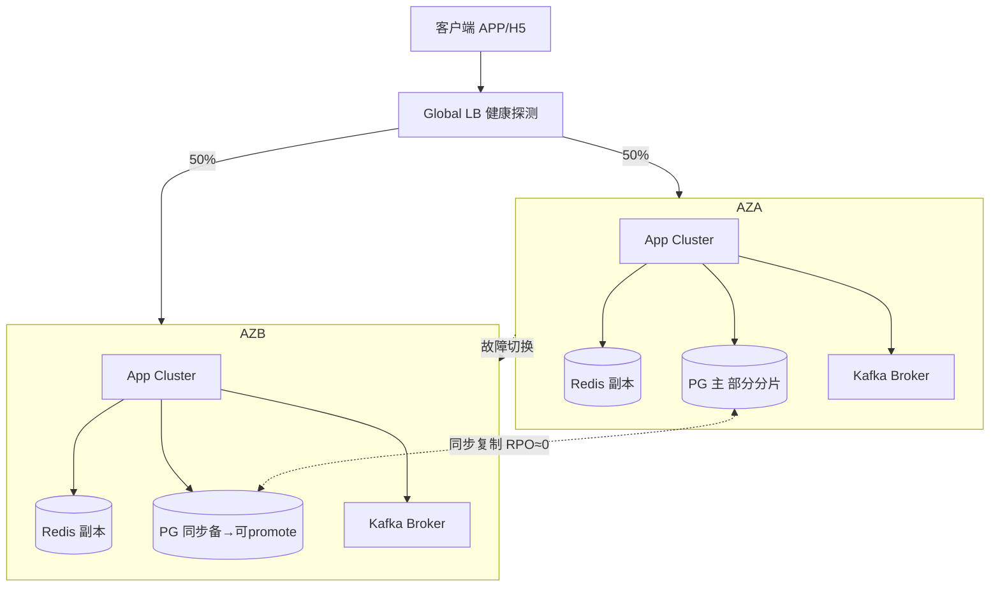
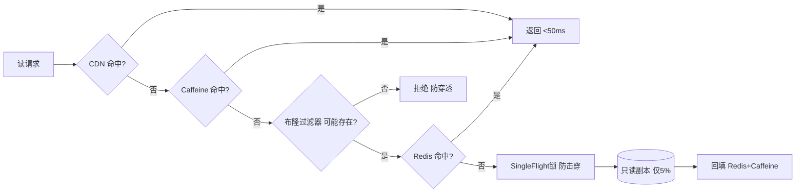
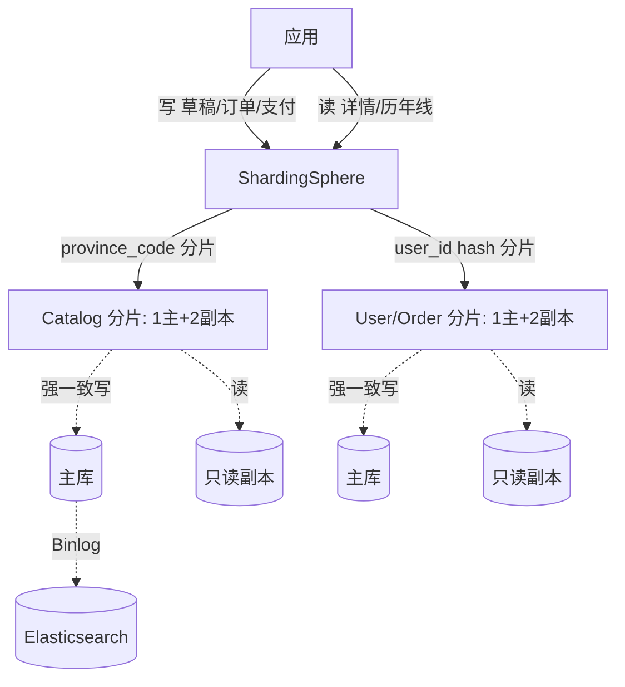
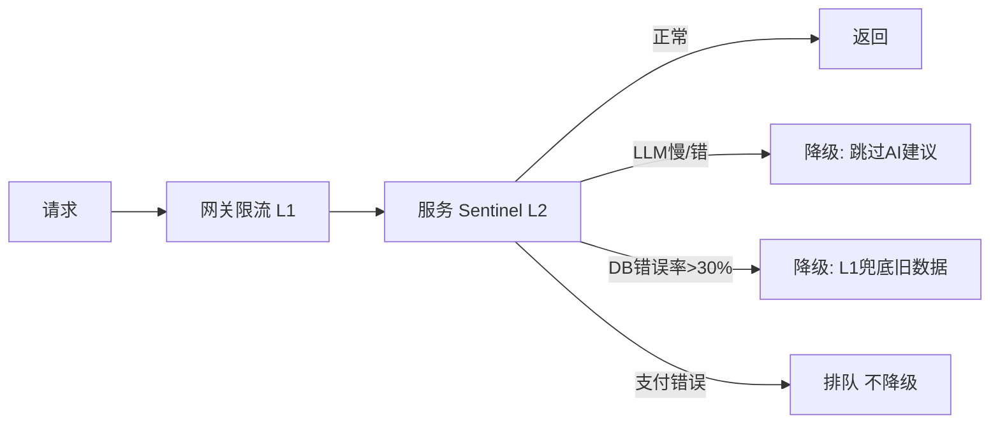

# 高考志愿填报APP — 后端系统架构规格书

| 字段 | 内容 |
|------|------|
| 文档版本 | V1.0 |
| 文档类型 | 后端系统架构规格书（高并发 / 高可用 / 高性能 + 领域化） |
| 架构师 | 磐石（Backend Architect） |
| 日期 | 2026-07-10 |
| 输入 | PRD V1.0、前端架构文档、战略方案、用户三项硬要求 |
| 技术栈假设 | **Java 17 + Spring Boot 3 + Spring Cloud + Caffeine + Redis Cluster + Kafka + Elasticsearch + PostgreSQL（ShardingSphere 分片）**。依据：用户已点名 Caffeine / Sentinel 系组件，与 Java 生态一致。如实际技术栈不同，可整文替换中间件而不影响架构骨架。 |

---

## 0. 模块映射说明（对齐用户编号）

现有交付物中尚无"模块 N"定义，本文按用户提到的编号显式约定如下，便于后续文档对齐：

| 编号 | 模块定位 | 本文覆盖章节 |
|------|---------|-------------|
| 模块 3 | 数据层与高性能基座（分库分表 / 读写分离 / 数据建模） | §5.1、§5.3 |
| 模块 4 | 高并发核心（三级缓存 / 流控 / Kafka 削峰 / 静态化） | §3、§5.2 |
| 模块 5 | 高可用与可靠性（双活 / 熔断降级 / 故障转移 / 发布回滚 / 混沌） | §4 |
| 模块 7 | 检索与计算性能（ES 模糊搜索 + 推荐计算异步化 + 容量规划） | §5.4、§6 |
| — | 领域化读写分离 & 安全基线（等保三级 + PII 加密） | §2、§7 |

> 若你的"模块 3/4/5/7"另有既定范围，告诉我，我按你的口径重排，不影响架构结论。

---

## 1. 总体架构

### 1.1 架构模式选型

| 维度 | 选型 | 理由 |
|------|------|------|
| 架构风格 | **微服务 + 适度聚合**（按域拆分，避免过细） | 脉冲洪峰下需独立扩缩容；推荐引擎/订单支付/检索域负载特征差异大 |
| 通信模式 | 客户端 REST/HTTPS；服务间 **gRPC**（高频内部调用）；异步事件 **Kafka** | gRPC 低延迟；Kafka 削峰解耦 |
| 数据模式 | **CQRS 思想 + 读写分离**：只读域走缓存/副本，写域走强一致 | 完美契合"读多写少 + 只读数据全预热"领域特征 |
| 部署模式 | 容器化（Docker）+ Kubernetes，多 AZ 部署 | 弹性扩缩 + 同城双活基础 |
| 流量入口 | API 网关（Spring Cloud Gateway / Kong）+ 全局负载均衡 | 双层限流第一层 |

### 1.2 服务拆分

```
                        ┌─────────────────────────────────────────┐
   客户端(APP/H5)  ───► │  Global LB  ──►  API Gateway (限流L1)     │
                        └─────────────────────────────────────────┘
                                          │
        ┌─────────────────────────────────┼─────────────────────────────────┐
        ▼                                 ▼                                 ▼
  Catalog Service                  Recommendation Engine              User/Draft Service
  (院校/专业/历年线,只读)          (7步流水线,异步)                   (用户/草稿,强一致写)
  L1 Caffeine + L2 Redis           Kafka消费+规则引擎回校验           Shard by user_id
        │                                 │                                 │
        ├──► Elasticsearch(模糊搜索)       ├──► AI Advice Service(LLM)       ├──► Order/Payment Service
        │                                 │        (异步,可降级)              │    (订单/支付,强一致写)
        ▼                                 ▼                                 ▼
  PostgreSQL(Catalog分片,province)   PostgreSQL(推荐结果表)         PostgreSQL(User/Order分片,user_id)
        ▲                                 ▲                                 ▲
        └──────────── 读写分离: 主写 + 只读副本(承载预热/缓存未命中读) ─────────┘

  横切:  安全/风控(等保三级) · 配置中心 · 注册中心 · 监控告警(Prometheus+Grafana) · 链路追踪(OTel)
  异步:  所有非强一致写 → Kafka Topic → 对应 Worker 消费(削峰)
```

**服务职责边界（与 PRD 对齐）：**

| 服务 | 核心职责 | 一致性要求 | 洪峰角色 |
|------|---------|-----------|---------|
| Catalog Service | 院校/专业/历年线/招生计划/选科要求，几乎只读，全量预热 | 最终一致（年更） | 读路径主力，95% 命中目标承担者 |
| User / Draft Service | 用户档案、填报草稿（断点续填） | **强一致**（用户不能丢草稿） | 强一致写路径 |
| Recommendation Engine | 7 步推荐流水线 + 规则引擎回校验 | 结果异步生成，最终一致 | 计算密集型，走 Kafka 异步 |
| AI Advice Service | 大模型生成"有态度"建议文案 | 可降级（不影响主流程） | 异步、可跳过 |
| Order / Payment Service | 订单、支付（未来商业化） | **强一致**（资金安全，不降级） | 强一致写路径，低频 |
| Search Service | ES 模糊搜索封装 | 最终一致 | 读路径，承接院校/专业名联想 |

### 1.3 领域化设计第一原则（统领全文）

志愿填报业务的本质是：**出分后 7–10 天脉冲洪峰 + 读多写少 + 考生信息高度敏感**。据此定下四条铁律：

1. **只读数据全量预热**：院校、专业、历年线、招生计划等"几乎只读"数据，在出分前全量预热进三级缓存，洪峰期间 DB 基本不承压。
2. **强一致写路径最小化**：只有 **订单 / 支付 / 草稿** 走强一致写（主库同步写 + ack）。其余（推荐生成、AI 建议、浏览/埋点、风控计算）一律 **异步化**（Kafka）。
3. **读写物理隔离**：强一致写走主库；读（含缓存未命中回源、预热）走只读副本。缓存命中即不触达 DB。
4. **安全默认从严**：按 **等保三级** 设计，考生 PII（姓名/身份证/手机号/分数/位次）字段级加密，密钥 KMS 托管、定期轮换。

---

## 2. 领域化读写分离落地（§0 铁律的具体实现）

```
┌─────────────────────────── 写路径（强一致，仅 3 类） ───────────────────────────┐
│ 草稿保存 / 订单创建 / 支付确认                                                  │
│   → API Gateway → 对应 Service → 主库(同步写, 行级锁/事务) → 返回 ack           │
│   → 异步: 写 Binlog/发事件 → 更新缓存(Cache-Aside Write) → 同步只读副本          │
└───────────────────────────────────────────────────────────────────────────────┘

┌─────────────────────────── 读路径（95% 命中目标） ───────────────────────────┐
│ 院校详情 / 专业详情 / 历年线 / 推荐结果查看                                     │
│   → CDN(静态页) → L1 Caffeine → L2 Redis → 只读副本(兜底, 回源后回填缓存)      │
└──────────────────────────────────────────────────────────────────────────────┘

┌─────────────────────────── 异步路径（削峰，其余一律） ───────────────────────┐
│ 推荐生成请求 / AI建议生成 / 浏览日志 / 埋点 / 风控特征计算                       │
│   → 生产 Kafka 事件 → Consumer Group 按自身速率消费 → 写结果/落库/更新缓存       │
└──────────────────────────────────────────────────────────────────────────────┘
```

**关键判断：为什么"推荐生成"算异步而不是强一致写？**
推荐结果对用户是"看到方案"，不是"资金/草稿持久化"。用户点"生成"→ 生产 `recommendation.generate` 事件 → 引擎异步算完写入结果表并缓存 → 前端轮询/推送拿到结果。洪峰下即使引擎忙，也只表现为"生成稍慢排队中"，不会压垮主链路。这正是 Kafka 削峰的价值。

---

## 3. 模块 4 — 高并发设计

> 重心模块。目标：**洪峰下读路径 95% 命中缓存、P95 < 200ms**。

### 3.1 三级缓存架构（Caffeine → Redis Cluster → CDN）

```
请求 → [L3 CDN] 热门静态页(院校/专业详情, 年更, 命中即返回, <50ms)
         ↓ 未命中
      [L1 Caffeine] 进程内, 热点 key, TTL 分钟级, 命中 <1ms
         ↓ 未命中
      [L2 Redis Cluster] 多 AZ, 全量预热数据 + 推荐结果, 命中 5-15ms
         ↓ 未命中(仅 5%)
      [只读副本 DB] 回源, 结果回填 L2 + L1
```

| 层级 | 技术 | 存储内容 | 容量/策略 | 命中预期 |
|------|------|---------|----------|---------|
| L3 | CDN（如阿里云 CDN / CloudFront） | 院校详情页、专业详情页、投档规则说明页（预渲染静态 HTML/JSON） | 年更数据，出分前全量预推；TTL 按数据版本 | 占读量 ~30% |
| L2 | Redis Cluster（3 分片 × 3 副本，跨 AZ） | 全量 Catalog 预热、推荐结果、一分一段表、热门列表 | 逻辑不过期(热点) + TTL 随机(普通)；内存水位 <75% | 占读量 ~60% |
| L1 | Caffeine（每实例本地） | TOP 热点 key（如 Top 100 院校、本省一分一段表） | maximumSize + expireAfterWrite(分钟) + refreshAfterWrite | 占读量 ~5–10% |

**三级合计命中率目标 ≥ 95%**，未命中 5% 由只读副本承载。

### 3.2 缓存穿透 / 击穿 / 雪崩 防护

| 风险 | 成因 | 防护方案 |
|------|------|---------|
| **穿透**（查不存在的 key） | 恶意/误请求不存在的 school_code/major_code，绕过缓存打 DB | ① **布隆过滤器**（各域独立 BF，预热时构建），不存在 key 在网关/服务层直接拒绝；② **空值缓存**（合法缺失也缓存 `NULL` 占位，TTL 随机 60–300s），防止重复回源 |
| **击穿**（单热点 key 过期瞬间高并发回源） | 某热点院校详情缓存到期，万级并发同时回源 | ① 热点 key **逻辑不过期**（后台主动 refresh，永不在读路径过期）；② 必须刷新时 **SingleFlight / Redis `SET NX` 分布式锁**，仅 1 个线程回源，其余复用 |
| **雪崩**（大量 key 同时过期 / Redis 挂） | 批量 key 同 TTL 失效，或 Redis 单点故障 | ① **TTL 加随机抖动**（base ± [0, 300s]）；② **Redis Cluster 多 AZ 多副本**，无单点；③ **L1 Caffeine 兜底**：Redis 短暂不可用时返回本地可能过期数据（牺牲极短一致性换可用）；④ 预热在出分前完成，洪峰期间 Redis 始终满载 |

```java
// 击穿防护示例：SingleFlight 风格（Guava Striped 锁 / Redis NX）
public SchoolDetail getSchool(String code) {
    SchoolDetail d = caffeine.getIfPresent(code);
    if (d != null) return d;                       // L1 命中
    // L2 + 回源加锁，防止击穿
    return redisLock.executeWithLock("lock:school:" + code, () -> {
        d = redis.get(code);
        if (d != null) { caffeine.put(code, d); return d; }
        if (bloomFilter.mightContain(code)) {      // 穿透防护
            d = schoolMapper.selectByCode(code);   // 仅 5% 落到副本
            if (d == null) redis.set(code, NULL, 120 + rand(180)); // 空值缓存
            else { redis.set(code, d, TTL_RANDOM); caffeine.put(code, d); }
        }
        return d;
    });
}
```

### 3.3 出分前热点预热（Hot Preheat）

- **预热时机**：出分前 7 天启动预热流水线（与数据更新窗口对齐）。
- **预热内容**：三省（山东/河北/湖南）全量 院校/专业/历年线/招生计划/选科要求 + 本省一分一段表 + Top N 热门院校详情静态页。
- **预热策略**：
  - 全量 Catalog 写入 Redis Cluster（按 province 分片）；
  - 预测热点（历史访问 Top、本省顶尖院校）额外写入 Caffeine + 推送 CDN 静态页；
  - 采用 **双缓冲（double-buffer）**：新版本先写入临时 key，全量就绪后原子 `RENAME` 切换，避免预热中途出现部分数据。
- **刷新**：数据年更时同样双缓冲切换；平时不变。

### 3.4 网关 + 应用 双层限流

| 层 | 位置 | 机制 | 作用 |
|----|------|------|------|
| **L1 网关层** | API Gateway / Global LB | 按 IP、按用户、按 API 的 **令牌桶/漏桶**；全局天花板；超出直接 429 | 在边缘廉价拦截，保护后端 |
| **L2 应用层** | 各服务内（Sentinel / Resilience4j） | 按资源 QPS/线程数限流 + 熔断 + 降级规则 | 精细到接口/依赖，防止单依赖拖垮整体 |

```yaml
# Sentinel 应用层规则示例（节选）
flowRules:
  - resource: "GET:/api/schools/{code}"     qps: 8000      # 详情读，宽松
  - resource: "POST:/api/recommend/generate" qps: 200       # 推荐生成，严(异步排队)
degradeRules:
  - resource: "aiAdviceLLM" strategy: RT maxRt: 2000 count: 0.5  # LLM 慢则降级跳过
```

### 3.5 Kafka 异步削峰

- **削峰对象**：推荐生成请求、AI 建议生成、浏览日志、埋点、风控特征计算。
- **机制**：客户端请求 → 生产事件到 Kafka（立即返回"已受理/排队中"）→ Consumer 按自身处理能力匀速消费。
- **价值**：把洪峰的"瞬时写高峰"拉平为"稳定消费速率"，后端只需按消费能力扩容 Consumer，不被上游尖刺击穿。
- **可靠性**（详见 §4.4）：`acks=all` + `min.insync.replicas=2` + 幂等 Producer + 消费幂等（按 eventId 去重）+ DLQ。

### 3.6 热门页静态化

- 院校详情页、专业详情页、投档规则说明页：**出分前预渲染为静态 HTML/JSON**，推 CDN（L3）。
- 数据年更 → 重新渲染 + CDN 刷新（缓存 purge）。
- 详情页中"个性化"部分（如命中率圆环）由前端用缓存 API 数据动态渲染，静态壳 + 动态片段，兼顾性能与个性。

### 3.7 模块 4 成功指标（SLO）

| 指标 | 目标 |
|------|------|
| 读路径缓存命中率（洪峰） | **≥ 95%** |
| 读路径 P95 延迟 | **< 200ms** |
| 读路径 P99 延迟 | < 500ms |
| CDN 命中率 | ≥ 85%（静态页） |
| 限流误杀率（正常用户被限） | < 0.1% |

---

## 4. 模块 5 — 高可用设计

> 目标：**单 AZ 故障不影响整体，故障自动转移，发布可灰可回**。

### 4.1 同城双活（Same-City Active-Active）

```
                    ┌─────────────── 城市 A ───────────────┐
   Global LB ──────┬────────────── AZ-A ───────────┐       │
   (健康探测,      │   App Cluster (读写)          │       │
    50/50 或        │   Redis Cluster(分片副本)     │  同步复制│
    按健康权重)     │   PG 主库(部分分片主) ───────┼───────┼──► AZ-B
                    │   Kafka Broker(跨AZ)          │       │   App Cluster (读写)
                    │   ES 节点                     │       │   Redis Cluster(分片副本)
                    └──────────────────────────────┘       │   PG 备库(部分分片主, 同步)
                                                           │   Kafka Broker
                                                           │   ES 节点
                                                           └──────────────────────────────┘
   故障转移：AZ-A 失联 → LB 探测失败 → 100% 流量切 AZ-B；PG 同步备库自动 promote 为主。
```

- 两 AZ 同城市（RTT < 2ms），均可独立承载 100% 流量。
- **数据同步**：PG 主备 **同步复制**（RPO≈0）；Redis Cluster 跨 AZ 副本；Kafka 多副本跨 AZ；ES 跨 AZ 副本。
- **故障判定**：LB 对健康端点（/health + 依赖探活）做秒级探测，AZ 级失联即切换。

### 4.2 单 AZ 故障不影响整体

| 组件 | 单 AZ 故障应对 |
|------|--------------|
| 应用 | 无状态，LB 把流量 100% 切到健康 AZ；K8s 在健康 AZ 自动补实例 |
| Redis | Cluster 多副本跨 AZ，主挂自动选主；L1 Caffeine 兜底读 |
| PostgreSQL | 同步备库（另一 AZ）自动 promote，RPO≈0，RTO < 30s |
| Kafka | 多 broker 跨 AZ，min.insync.replicas=2 保证可用副本，生产不中断 |
| ES | 跨 AZ 副本，分片自动重分配 |
| CDN | 边缘节点多运营商，单节点故障无感 |

### 4.3 限流 / 熔断 / 降级 矩阵

> 这是高可用的"操作手册"，每个依赖都必须有明确定义，禁止"裸调"。

| 服务/依赖 | 限流(QPS/实例) | 熔断阈值 | 降级策略（触发后返回什么） |
|----------|---------------|---------|--------------------------|
| Catalog DB 读(副本) | 5000 | 错误率>30% 10s | 走 L1 Caffeine 返回可能稍旧数据 |
| Recommendation Engine | 200 | 错误率>50% 10s | 返回"排队生成中"页 / 上次缓存结果 |
| AI Advice(LLM) | 50 | RT>2s 或错误率>20% | **直接跳过 AI 建议**，仅返回规则引擎结果（不影响主流程） |
| Order / Payment | 100 | 错误率>10% | **不降级**（资金安全），仅排队+友好提示 |
| Elasticsearch | 1000 | 错误率>25% | 返回"搜索暂不可用"，院校/专业名联想退化为本地前缀匹配 |
| 第三方数据 API | 30 | 超时>3s | 返回缓存快照 + "数据可能非最新"标识 |

### 4.4 Kafka 可靠投递

- `acks=all`：Leader 需所有 ISR 副本确认。
- `min.insync.replicas=2`，`replication.factor=3`（跨 AZ）。
- **幂等 Producer**（`enable.idempotence=true`）+ 生产端去重。
- **消费幂等**：Handler 按 `eventId` 去重（Redis/DB 唯一约束），实现 effectively-once。
- **DLQ**： poison message / 重试 N 次失败 → 进入死信队列，告警 + 人工/定时重放。
- **不丢**：消费完成才 `commitAsync`，崩溃从 last committed offset 重放。

### 4.5 数据库自动故障转移

- PG 采用 **Patroni + etcd**（或云厂商 Multi-AZ 托管）管理主备。
- 主库与同步备库（另一 AZ）**同步复制** → 主挂，备库数据零丢失，自动 promote。
- 故障切换 < 30s，应用通过 **连接管理器（如 PgBouncer + 自动重连）** 无感切换。
- 切换期间在途事务由客户端重试（幂等）吸收。

### 4.6 灰度发布 + 一键回滚

- **金丝雀发布**：5% → 25% → 50% → 100%，每阶段健康检查（错误率、P95、饱和度）门禁，不达标自动暂停。
- **不可变镜像**：每次发布是全新镜像 + 配置，旧版本保留。
- **一键回滚**：流量权重秒级切回上一稳定版本（或镜像替换），RTO < 5min。
- **Feature Flag**：高风险变更（如新推荐算法）先 flag 关闭，灰度中开启，异常即关。

### 4.7 全链路压测 + 混沌工程

- **全链路压测**：生产影子流量 / 流量录制回放，在隔离环境按 N× 峰值为目标施压，定位瓶颈（缓存命中率、DB 连接、Kafka lag、GC）。
- **混沌工程**（持续，非一次性）：
  - 注入：AZ 整体失联、Redis 单分片主挂、Kafka broker 宕、PG 主 kill、网络分区、CPU 打满、依赖超时。
  - 验证：SLO 是否守住、故障是否自动转移、告警是否触发、恢复时间。
  - 工具：Chaos Mesh / Litmus，纳入 CI 周期性执行。

### 4.8 模块 5 成功指标（SLO）

| 指标 | 目标 |
|------|------|
| 系统可用性 | **≥ 99.9%** |
| 单 AZ 故障 RTO | < 30s（流量）/ < 30s（DB promote） |
| RPO（数据丢失） | ≈ 0（同步复制） |
| 灰度回滚耗时 | < 5min |
| 混沌演练覆盖率 | 核心依赖 100% 有注入用例 |

---

## 5. 模块 3 / 4 / 7 — 高性能设计

### 5.1 分库分表（按省份 / 用户）

**分片策略（ShardingSphere 中间件，对应用透明）：**

| 数据域 | 分片键 | 分片方式 | 说明 |
|--------|--------|---------|------|
| Catalog（score_line / admission_plan / subject_requirement / school_info / major_info） | **province_code** | 按省分库分表 | 每省数据有界；MVP 3 省，全国 31 省 × N 表；查询天然带 province，无跨片 |
| User / Draft / Order / Payment | **user_id（hash）** | 按用户哈希分片 | 与省份无关，保证均匀分布；强一致写落在单分片事务内 |

- **为什么 Catalog 按省而不是按用户**：院校/历年线查询永远带 `province_code`，按省分片使单次查询命中单分片，无跨分片 JOIN；每分片数据量小、易全量预热。
- **为什么 User/Order 按 user_id 哈希**：用户与订单分布与省无关，哈希分片避免热点省倾斜，单用户事务落在单分片保证 ACID。
- 跨域关联（如"某用户的推荐结果"含多省院校）由应用层/搜索引擎（ES）组装，不在 DB 做跨分片 JOIN。

### 5.2 读写分离（模块 4 已引用，此处落地）

- 每个分片：**1 主 + 2 只读副本**。
- **写**：强一致三类（草稿/订单/支付）→ 主库。
- **读**：缓存未命中回源、预热任务 → 只读副本。
- 因洪峰 95% 读命中缓存，副本实际承压仅 5% 读量，余量充足。
- 副本延迟监控：强一致写完需立即读的极少场景（如草稿刚保存后查看）走主库（`HintManager` 强制主库读），其余走副本。

### 5.3 数据建模要点（对齐 PRD 附录 A）

- 六张核心表（score_line / score_rank / admission_plan / school_info / major_info / subject_requirement）保持 PRD 定义，增加：
  - **分片键列**（province_code 或 user_id）；
  - **版本号 / data_year** 用于双缓冲与数据时效标识；
  - **逻辑过期/软删** 列。
- 索引：在 `province_code + year + (major_code/school_code)` 复合索引，覆盖推荐引擎候选池初筛与位次反查。

### 5.4 ES 承载模糊搜索（模块 7）

- **索引**：`schools`（名称/别名/城市/层次/标签）、`majors`（名称/门类/就业方向/描述）、`admission_plan`（院校+专业组合，用于联想）。
- **能力**：中文分词（IK）+ 拼音分词 → 院校名/专业名模糊联想（Step 3 搜索式多选）、错别字容错、就业方向检索。
- **与缓存关系**：ES 结果可缓存进 Redis（搜索结果 TTL 短），搜索请求本身受 §4.3 限流与降级保护；ES 不可用时退化为本地前缀匹配。
- **数据同步**：Catalog 更新经 Binlog/事件 → 同步 ES（近实时，秒级）。

### 5.5 推荐计算异步化（模块 7 计算性能）

- 推荐引擎本身是计算密集型（7 步流水线 + 规则回校验），**绝不放在同步请求里**。
- 用户触发 → Kafka `recommendation.generate` → Engine Consumer 拉取，按自身算力匀速处理 → 写结果表 + 缓存 → 前端轮询/WebSocket 推送。
- 这样洪峰时引擎可以"慢慢算"，前端显示进度，主读链路零压力。

---

## 6. 容量规划与扩容临界点

### 6.1 容量模型（示意，需按真实预估替换）

| 参数 | 假设值 | 说明 |
|------|--------|------|
| 出分当日 DAU 峰值 | 80 万 | 2027 季盈亏平衡 6–8 万，洪峰按更高保守估计 |
| 活跃考生（7–10 天） | 50 万 | 集中在出分后 48h |
| 峰值读 QPS | 30 万 | 详情/推荐查看密集 |
| 目标缓存命中 | 95% | → 仅 1.5 万 QPS 落 Redis/DB |
| 写 QPS（强一致） | < 2000 | 草稿/订单，低频 |
| 异步事件 QPS | ~5 万 | 推荐生成+埋点，Kafka 削峰 |

### 6.2 各层容量与扩容临界点

| 层 | 基线配置 | **扩容临界点（触发即扩）** |
|----|---------|--------------------------|
| 应用实例 | 20 实例（4C8G），HPA 上限 120 | P95 > 150ms 或 CPU > 60% 持续 3min → 加实例；错误率 > 1% → 查因 |
| Redis Cluster | 3 分片 × 3 副本 | **内存 > 75%** → 加分片；单分片 CPU > 70% → 加副本；命中率 < 92% → 查预热 |
| PostgreSQL | 每分片 1 主 + 2 副本 | 副本 CPU > 65% → 加只读副本；主连接数 > 80% → 加连接池/拆分；慢查询 > 阈值 → 索引优化 |
| Kafka | 6 broker 跨 AZ | **消费 lag > 10 万** → 加 Consumer；磁盘 > 80% → 扩盘；ISR 收缩告警 |
| ES | 3 节点跨 AZ | 查询 P95 > 200ms 或 CPU > 70% → 加数据节点 |
| CDN | 按带宽弹性 | 回源率 > 15% → 查静态化覆盖；带宽逼近套餐 → 提配 |

### 6.3 压测闭环

1. 容量模型给出"临界点" → 2. 全链路压测验证临界点真实有效 → 3. 混沌注入验证降级/转移 → 4. 形成**自动扩缩容 HPA/VPA 规则** → 5. 出分前演练一次真实比例洪峰。

---

## 7. 安全模块（等保三级 + PII 加密从严）

> 考生多为未成年人，且信息高度敏感，安全默认按**等保三级**设计，考生个人信息加密从严。

### 7.1 等保三级对照落地

| 等保三级要求 | 落地措施 |
|-------------|---------|
| 身份鉴别 | 用户强密码/短信验证；管理后台 MFA；登录失败锁定；会话短期有效（JWT 短 TTL + 刷新） |
| 访问控制 | RBAC 最小权限；服务间 mTLS；数据库按服务独立账号、最小授权 |
| 传输安全 | 全链路 TLS 1.3；内外网隔离；API 网关统一 TLS 终止 + WAF |
| 存储安全 | **考生 PII 字段级加密**（AES-256-GCM，KMS 托管密钥，定期轮换）；静态数据加密（磁盘/备份加密） |
| 安全审计 | 全量操作审计日志（谁/何时/何操作），留存 ≥ 6 个月；异常行为告警 |
| 入侵防范 | WAF、限流、漏洞扫描、依赖组件 CVE 监控、RASP |
| 数据备份与恢复 | 每日备份 + 异地副本；定期恢复演练（RTO/RPO 达标） |
| 集中管控 | 统一日志/监控/告警（SIEM 思路），安全事件可追溯 |

### 7.2 考生个人信息加密从严

- **加密字段**：姓名、身份证号、手机号、高考分数、省位次、特殊身份、单科成绩等 PII。
- **方案**：应用层字段级加密（AES-256-GCM），密钥由 **KMS** 托管并按数据域隔离；密钥定期轮换，旧密文用旧密钥可解（版本化密钥）。
- **脱敏**：日志/埋点/监控中 PII 一律脱敏（手机号 `138****1234`）；前端展示按需掩码。
- **数据最小化**：仅采集推荐必需字段；草稿/订单与 PII 关联通过 token，非明文直存。
- **合规**：遵循《个人信息保护法》《未成年人保护法》；提供撤回/删除能力；跨境/第三方共享默认禁止。

### 7.3 应用层安全基线（贯穿所有模块）

- 所有输入参数化（防 SQL 注入）；输出转义（防 XSS）；网关统一 CSP/WAF。
- API 鉴权（OAuth2/JWT 短 TTL）+ 防重放（nonce/时间戳）。
- 密钥/配置走配置中心+密钥管理，禁止硬编码。
- 第三方 LLM 调用：不传明文 PII 给外部模型；仅传必要特征；输出经规则引擎回校验（PRD 已定）。

---

## 8. 成功指标总览（SLO 汇总）

| 维度 | 指标 | 目标 |
|------|------|------|
| 高并发 | 读路径缓存命中率（洪峰） | ≥ 95% |
| 高并发 | 读路径 P95 | < 200ms |
| 高可用 | 系统可用性 | ≥ 99.9% |
| 高可用 | 单 AZ 故障 RTO / RPO | < 30s / ≈ 0 |
| 高性能 | 数据库查询平均时延 | < 100ms（命中副本/缓存） |
| 高性能 | 推荐生成（异步）端到端 | < 5s（常态），洪峰可排队 |
| 安全 | 等保测评 | 三级通过；0 高危漏洞 |
| 弹性 | 10× 常态流量 | 自动扩容承接，SLO 不破 |

---

## 9. 待确认 / 风险

| 编号 | 问题 | 影响 | 建议决策方 |
|------|------|------|-----------|
| B-01 | 后端技术栈是否确认为 Java/Spring Cloud？仍是假设 | 全文中间件选型 | 技术负责人 |
| B-02 | Catalog 按省分片，未来扩到 31 省时分片数如何规划（每省单库 or 多省合并） | 分片架构演进 | 后端+数据 |
| B-03 | 草稿"强一致写"在洪峰下是否允许极短异步缓冲（先本地 ack 再异步落库）以进一步削峰？涉及丢数据风险权衡 | 写路径架构 | 产品+后端 |
| B-04 | 推荐结果是否也按用户缓存（同输入复用）？可大幅提升命中率 | 缓存策略 | 后端+产品 |
| B-05 | 等保三级测评由谁牵头、时间表？需在出分前完成 | 合规 | 安全+法务 |
| B-06 | 真实容量预估数字（DAU/峰值QPS）以谁口径为准？本文为示意 | 容量规划 | 产品+数据 |

---

## 附录 A：关键架构图（mermaid）

> 完整可渲染图见同目录 `backend-architecture-topology.mermaid`。以下为内联摘要。

### A.1 同城双活总体拓扑


### A.2 三级缓存读路径与防护


### A.3 数据分片与读写分离


### A.4 限流熔断降级矩阵（节选）


---

*架构规格书 V1.0 完成。本文由后端架构师磐石基于用户三项硬要求（高并发/高可用/高性能）及领域化关键点（读多写少、脉冲洪峰、考生敏感信息、等保三级）撰写，对齐 PRD V1.0 与前端架构。技术栈为假设，模块 3/4/5/7 映射见 §0，可按实际口径调整。*
