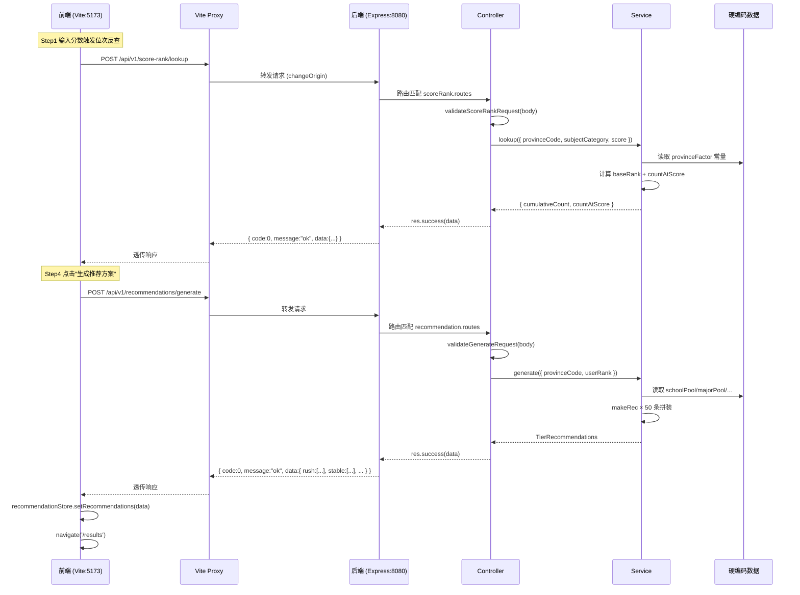
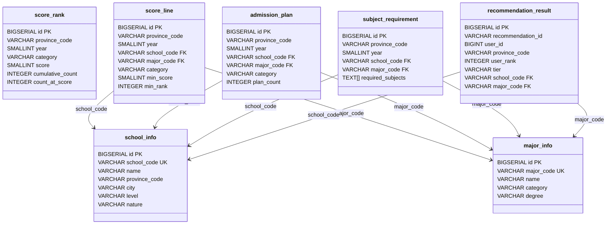
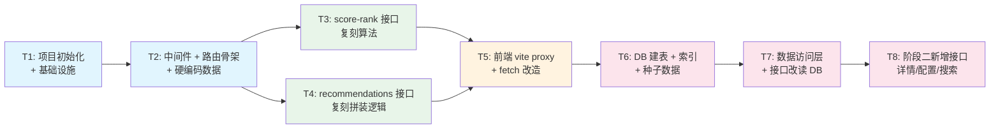

# 高考志愿填报APP — 后端 MVP 架构设计与任务分解

| 字段 | 内容 |
|------|------|
| 文档版本 | V1.0 |
| 文档类型 | 后端 MVP 架构设计 + 任务分解 |
| 架构师 | 高见远（Bob / Gao） |
| 日期 | 2026-07-10 |
| 输入 | 增量PRD V1.0（API契约）、后端架构规格书 V1.0、前端源码（`src/data/dynamic/`、`src/hooks/`、`src/store/`、`src/types/`、`vite.config.ts`） |
| 范围 | 阶段一（通路，写死数据）+ 阶段二（PostgreSQL），含技术选型、项目结构、API设计、任务分解、DB Schema、前端改造方案 |

---

## 1. 技术选型与理由

### 1.1 后端语言/框架：Node.js 18+ / Express 4 / TypeScript 5

**决策：采用 Node.js + Express + TypeScript，而非架构规格书假设的 Java/Spring Boot。**

| 决策维度 | Node.js + Express + TS | Java + Spring Boot |
|---------|----------------------|-------------------|
| **MVP 阶段一目标** | 2 个接口 + 硬编码数据，Express 最小化启动 < 1s | Spring Boot 启动 5-10s，需搭建项目骨架、Gradle/Maven 依赖 |
| **类型对齐** | 与前端同 TypeScript 生态，可直接复用 `src/types/` 定义 | 需手动用 Java POJO 重写类型，对齐成本高 |
| **本地部署** | `npm install && npm run dev`，零额外环境 | 需 JDK 17 + Gradle/Maven，启动重 |
| **阶段二演进** | `pg` 驱动直连 PostgreSQL，Prisma 可选 | 原生 JPA/MyBatis + ShardingSphere |
| **长期架构对齐** | 阶段三若需高并发/微服务化，可独立重写后端服务为 Java | 直接对齐架构规格书的微服务方案 |

**核心理由**：

1. **MVP 优先通路**：当前目标是"前端 fetch 打通后端"，2 个接口 + 硬编码数据，Node.js 最轻量快速。
2. **类型安全共享**：前后端同为 TypeScript，后端可直接 `import` 前端的 `src/types/recommendation.ts`、`src/types/form.ts`、`src/types/common.ts`，保证响应体逐字段一致（PRD §0.3 第 1 条"类型完全对齐"）。
3. **部署简单**：用户要求"后端部署在本地"，Node.js 无需 JVM，`npm run dev` 即可。
4. **阶段二平滑过渡**：`pg` 驱动 + 连接池直连 PostgreSQL 即可，无需 ORM 也能完成 MVP 读写。Prisma 可在需要 schema 迁移管理时引入。

**框架选择：Express vs Fastify vs NestJS**

| 框架 | 评价 |
|------|------|
| **Express** ✅ 选定 | 最简、生态最大、中间件模型直观。2 个接口不需要 NestJS 的 DI/装饰器开销。 |
| Fastify | 性能略优，但中间件 API 与 Express 不完全兼容，团队学习成本高，MVP 不值得。 |
| NestJS | 过度设计：controller/service/module 分层 + DI 容器，2 个接口杀鸡用牛刀。 |

### 1.2 数据库（阶段二）：PostgreSQL 16 + `pg` 驱动

| 选项 | 评价 |
|------|------|
| **`pg`（node-postjs）** ✅ 选定 | 轻量、原生 SQL、连接池内置（`pg.Pool`）。MVP 6 张表 + 简单查询，无需 ORM 抽象。 |
| Prisma | 优势在 schema 迁移 + 类型安全查询，但引入 codegen + 二进制引擎，MVP 阶段增加复杂度。阶段三可考虑。 |
| TypeORM | 装饰器 + Active Record/Data Mapper 模式，与 NestJS 耦合较深，单独用偏重。 |

**结论**：阶段二用 `pg.Pool` 直连 PostgreSQL，手写 SQL + TypeScript 类型映射。简洁、可控。

### 1.3 端口选择：8080

| 项 | 值 |
|----|-----|
| 前端 Vite dev server | 5173（现有，不变） |
| 后端 API server | **8080**（对齐 PRD §5.2 的 vite proxy target） |

选择 8080 理由：PRD 中 vite proxy 示例已写 `target: 'http://localhost:8080'`，保持一致避免改动。8080 是 HTTP 常用端口，本地无冲突即可。

### 1.4 CORS / Vite Proxy 方案

**方案：Vite Proxy（开发期）+ CORS 中间件（兜底）**

```
浏览器(localhost:5173) ──fetch('/api/...')──► Vite Dev Server(5173)
                                                  │ proxy (changeOrigin)
                                                  ▼
                                          Backend API(localhost:8080)
```

- **开发期**：Vite proxy 转发 `/api` → `http://localhost:8080`，前端 fetch 用相对路径 `/api/v1/...`，无跨域。
- **CORS 兜底**：后端仍挂 `cors` 中间件（允许 `localhost:5173`），以防直连场景（如 Postman 测试、非 Vite 环境）。
- **生产部署**：前后端同域（Nginx 反代），proxy/CORS 不再需要。

---

## 2. 后端项目结构

### 2.1 目录结构

```
backend/
├── package.json                 # 依赖声明 + 脚本
├── tsconfig.json                # TypeScript 编译配置
├── .env.example                 # 环境变量模板（阶段二用）
├── .gitignore
│
├── src/
│   ├── index.ts                 # 应用入口：创建 Express app + 启动监听
│   ├── app.ts                   # Express app 配置：中间件注册 + 路由挂载
│   │
│   ├── config/
│   │   └── env.ts               # 环境变量读取（PORT, DB 连接等）
│   │
│   ├── types/
│   │   ├── index.ts             # 后端专用类型（ApiResponse, 错误码枚举）
│   │   └── shared.ts            # 从前端 src/types/ 复制的共享类型（Recommendation, TierRecommendations, RankLookupResult 等）
│   │
│   ├── middleware/
│   │   ├── response.ts          # 统一响应封装中间件（res.json 包装 { code, message, data }）
│   │   ├── error.ts             # 全局错误处理中间件（捕获异常 → 统一格式）
│   │   └── notFound.ts          # 404 路由未找到处理
│   │
│   ├── routes/
│   │   ├── index.ts             # 路由聚合（挂载 /api/v1 前缀）
│   │   ├── scoreRank.routes.ts  # POST /api/v1/score-rank/lookup
│   │   └── recommendation.routes.ts  # POST /api/v1/recommendations/generate
│   │
│   ├── controllers/
│   │   ├── scoreRank.controller.ts   # 位次反查控制器：请求校验 + 调 service + 包装响应
│   │   └── recommendation.controller.ts  # 推荐生成控制器
│   │
│   ├── services/
│   │   ├── scoreRank.service.ts      # 位次反查业务逻辑（阶段一硬编码算法，阶段二读 DB）
│   │   └── recommendation.service.ts # 推荐生成业务逻辑（阶段一硬编码拼装，阶段二读 DB + 推荐引擎）
│   │
│   ├── data/
│   │   ├── scoreRankData.ts          # 硬编码常量：provinceFactor（对齐 scoreRank.json）
│   │   └── recommendationData.ts     # 硬编码常量：schoolPool / majorPool / tierHitRateRanges / riskTemplates / aiAdviceTemplates
│   │
│   └── utils/
│       └── validator.ts             # 请求参数校验工具函数
│
├── sql/                              # 阶段二数据库脚本
│   ├── 001_create_tables.sql         # 建表 DDL（6 张核心表）
│   ├── 002_create_indexes.sql        # 索引 DDL
│   └── seed/
│       └── 001_seed_data.sql         # 种子数据（对齐 mock 数据）
│
└── tests/                            # 阶段一验收测试（可选）
    └── api.test.ts                   # 接口一致性测试
```

### 2.2 文件清单（完整路径）

| # | 文件路径 | 说明 | 阶段 |
|---|---------|------|------|
| 1 | `backend/package.json` | 依赖声明 + npm scripts | 一 |
| 2 | `backend/tsconfig.json` | TS 编译配置（ESM, Node 18, strict） | 一 |
| 3 | `backend/.env.example` | 环境变量模板 | 一 |
| 4 | `backend/.gitignore` | 忽略 node_modules/dist/.env | 一 |
| 5 | `backend/src/index.ts` | 应用入口 | 一 |
| 6 | `backend/src/app.ts` | Express app 配置 | 一 |
| 7 | `backend/src/config/env.ts` | 环境变量读取 | 一 |
| 8 | `backend/src/types/index.ts` | 后端类型（ApiResponse, ErrorCode） | 一 |
| 9 | `backend/src/types/shared.ts` | 共享类型（复制自前端） | 一 |
| 10 | `backend/src/middleware/response.ts` | 统一响应封装 | 一 |
| 11 | `backend/src/middleware/error.ts` | 全局错误处理 | 一 |
| 12 | `backend/src/middleware/notFound.ts` | 404 处理 | 一 |
| 13 | `backend/src/routes/index.ts` | 路由聚合 | 一 |
| 14 | `backend/src/routes/scoreRank.routes.ts` | 位次反查路由 | 一 |
| 15 | `backend/src/routes/recommendation.routes.ts` | 推荐生成路由 | 一 |
| 16 | `backend/src/controllers/scoreRank.controller.ts` | 位次反查控制器 | 一 |
| 17 | `backend/src/controllers/recommendation.controller.ts` | 推荐生成控制器 | 一 |
| 18 | `backend/src/services/scoreRank.service.ts` | 位次反查服务 | 一 |
| 19 | `backend/src/services/recommendation.service.ts` | 推荐生成服务 | 一 |
| 20 | `backend/src/data/scoreRankData.ts` | 硬编码 provinceFactor | 一 |
| 21 | `backend/src/data/recommendationData.ts` | 硬编码推荐素材 | 一 |
| 22 | `backend/src/utils/validator.ts` | 请求校验 | 一 |
| 23 | `backend/sql/001_create_tables.sql` | 建表 DDL | 二 |
| 24 | `backend/sql/002_create_indexes.sql` | 索引 DDL | 二 |
| 25 | `backend/sql/seed/001_seed_data.sql` | 种子数据 | 二 |

### 2.3 依赖包列表

**`package.json` dependencies（阶段一）**：

```json
{
  "dependencies": {
    "express": "^4.21.0",
    "cors": "^2.8.5",
    "dotenv": "^16.4.5"
  },
  "devDependencies": {
    "typescript": "^5.6.0",
    "@types/express": "^4.17.21",
    "@types/cors": "^2.8.17",
    "@types/node": "^20.19.0",
    "tsx": "^4.19.0",
    "ts-node": "^10.9.2"
  }
}
```

| 包 | 用途 |
|----|------|
| `express` | Web 框架 |
| `cors` | CORS 中间件（兜底） |
| `dotenv` | 环境变量加载（阶段二 DB 配置） |
| `tsx` | TypeScript 直接运行（`npm run dev`），替代 `ts-node`，更快 |
| `typescript` / `@types/*` | 类型系统 |

**阶段二新增依赖**：

```json
{
  "dependencies": {
    "pg": "^8.13.0"
  },
  "devDependencies": {
    "@types/pg": "^8.11.0"
  }
}
```

---

## 3. API 实现设计

### 3.1 路由设计（对齐 PRD §3）

| Method | Path | Controller | Service | 阶段 |
|--------|------|-----------|---------|------|
| POST | `/api/v1/score-rank/lookup` | `scoreRankController.lookup` | `scoreRankService.lookup` | 一 |
| POST | `/api/v1/recommendations/generate` | `recommendationController.generate` | `recommendationService.generate` | 一 |
| GET | `/api/v1/recommendations/:id` | `recommendationController.getDetail` | `recommendationService.getDetail` | 二 |
| GET | `/api/v1/config` | `configController.getConfig` | `configService.getConfig` | 二（可选） |
| GET | `/api/v1/schools/:code` | `schoolController.getDetail` | `schoolService.getDetail` | 二 |
| GET | `/api/v1/majors/:code` | `majorController.getDetail` | `majorService.getDetail` | 二 |
| GET | `/api/v1/search/suggest` | `searchController.suggest` | `searchService.suggest` | 二 |

> 阶段一仅实现前 2 个。

### 3.2 统一响应中间件

**设计思路**：不使用 Express 的 `res.json()` 直接返回，而是通过 `res.success(data)` / `res.fail(code, message)` 辅助方法封装统一格式。

```typescript
// src/middleware/response.ts
import { Response, Request, NextFunction } from 'express';

// 扩展 Response 类型，增加 success/fail 辅助方法
declare global {
  namespace Express {
    interface Response {
      success: (data: unknown, message?: string) => void;
      fail: (code: number, message: string) => void;
    }
  }
}

export function responseMiddleware(req: Request, res: Response, next: NextFunction) {
  res.success = (data: unknown, message = 'ok') => {
    res.json({ code: 0, message, data });
  };
  res.fail = (code: number, message: string) => {
    res.json({ code, message, data: null });
  };
  next();
}
```

### 3.3 错误处理中间件

```typescript
// src/middleware/error.ts
import { ErrorRequestHandler } from 'express';
import { ErrorCode } from '@/types';

export const errorHandler: ErrorRequestHandler = (err, req, res, next) => {
  console.error('[Error]', err);

  // 业务校验错误（controller 主动抛出）
  if (err.code && typeof err.code === 'number') {
    return res.status(err.httpStatus || 400).json({
      code: err.code,
      message: err.message,
      data: null,
    });
  }

  // 未知异常
  return res.status(500).json({
    code: ErrorCode.INTERNAL_ERROR,
    message: '服务内部错误',
    data: null,
  });
};
```

### 3.4 错误码定义

```typescript
// src/types/index.ts
export enum ErrorCode {
  SUCCESS = 0,
  VALIDATION_ERROR = 1001,    // 参数校验失败
  NOT_FOUND = 1002,           // 资源不存在
  INTERNAL_ERROR = 2001,      // 服务内部错误
  UPSTREAM_TIMEOUT = 2002,    // 上游依赖超时（阶段二）
}

// 业务异常类
export class BusinessException extends Error {
  constructor(
    public code: number,
    message: string,
    public httpStatus: number = 400,
  ) {
    super(message);
  }
}
```

### 3.5 请求校验

阶段一不引入 `zod`/`joi` 等校验库（前端已有 zod，后端 MVP 手写校验即可），减少依赖。

```typescript
// src/utils/validator.ts
import { ErrorCode } from '@/types';
import { BusinessException } from '@/types';

export function validateScoreRankRequest(body: unknown) {
  const { provinceCode, subjectCategory, score } = body as any;

  if (!provinceCode || typeof provinceCode !== 'string') {
    throw new BusinessException(ErrorCode.VALIDATION_ERROR, 'provinceCode 必须为非空字符串');
  }
  if (!['physics', 'history', 'comprehensive'].includes(subjectCategory)) {
    throw new BusinessException(ErrorCode.VALIDATION_ERROR, 'subjectCategory 必须为 physics/history/comprehensive');
  }
  if (typeof score !== 'number' || score < 0 || score > 750) {
    throw new BusinessException(ErrorCode.VALIDATION_ERROR, 'score 必须为 0-750 的数字');
  }
}
```

### 3.6 位次反查接口实现（复刻前端算法）

```typescript
// src/services/scoreRank.service.ts
import { provinceFactor } from '@/data/scoreRankData';

export function lookup(params: {
  provinceCode: string;
  subjectCategory: 'physics' | 'history' | 'comprehensive';
  score: number;
}): { cumulativeCount: number; countAtScore: number } {
  const { provinceCode, subjectCategory, score } = params;

  // 复刻前端 getScoreRank 算法（src/data/dynamic/index.ts）
  const factor =
    (provinceFactor[provinceCode] ?? 1.0) *
    (subjectCategory === 'history' ? 0.4 : 1.0);

  const baseRank = Math.round((750 - score) * (80 + score * 0.08) * factor);
  const cumulativeCount = Math.max(baseRank, 1);

  // 复刻前端 mockScoreRankLookup 的同分人数算法（src/hooks/useScoreRankLookup.ts）
  const countAtScore = Math.max(Math.round(50 - (750 - score) * 0.06), 5);

  return { cumulativeCount, countAtScore };
}
```

### 3.7 推荐生成接口实现（复刻前端拼装逻辑）

```typescript
// src/services/recommendation.service.ts
import { schoolPool, majorPool, tierHitRateRanges, riskTemplates, aiAdviceTemplates }
  from '@/data/recommendationData';
import type { TierRecommendations, Recommendation, Tier, RiskSignal } from '@/types/shared';

const PROVINCE_NAMES: Record<string, string> = { '37': '山东', '13': '河北', '43': '湖南' };
const COUNT = { rush: 19, stable: 12, preserve: 14, cushion: 5 } as const;

export function generate(params: {
  provinceCode: string;
  userRank: number;
}): TierRecommendations {
  const { provinceCode, userRank } = params;
  const provinceName = PROVINCE_NAMES[provinceCode] ?? '山东';
  const rankBase = Math.round(userRank / 1000) * 1000;

  function makeRec(tier: Tier, index: number, schoolIdx: number, majorIdx: number): Recommendation {
    const school = schoolPool[schoolIdx % schoolPool.length];
    const major = majorPool[majorIdx % majorPool.length];
    const [hitMin, hitMax] = tierHitRateRanges[tier];
    const offset = (index % 5) * 2;
    const hitRateMin = Math.max(hitMin + offset, 1);
    const hitRateMax = Math.min(hitMax, 99);

    const risks: RiskSignal[] = riskTemplates
      .filter((tpl) => {
        const c = tpl.condition;
        if (c.tier && tier !== c.tier) return false;
        if (c.excludeTier && tier === c.excludeTier) return false;
        return index % c.indexMod === c.indexEquals;
      })
      .map((tpl) => ({
        type: tpl.type, level: tpl.level, message: tpl.message, suggestion: tpl.suggestion,
      }));

    const hitRateStr = `${hitRateMin}-${hitRateMax}%`;

    return {
      id: `${tier}-${index}`,
      school: school.name,
      major,
      tags: [school.level, school.nature, school.city],
      tier,
      hitRate: hitRateStr,
      hitRateMin, hitRateMax,
      risks,
      aiAdvice: aiAdviceTemplates[tier].replace('{school}', school.name).replace('{major}', major),
      aiAdvantage: `${school.name}${major}专业与你的选科高度匹配，学科评估优秀。`,
      aiSuggestion:
        tier === 'stable'
          ? '建议放在稳档前1/3位置（约第8-12个志愿）'
          : `建议放在${tier === 'rush' ? '冲刺档' : tier === 'preserve' ? '保底档' : '垫底档'}合适位置`,
      dataSource: `${provinceName}省教育招生考试院`,
      dataYear: '2022-2024年',
      isNewMajor: major === '人工智能' || major === '数据科学与大数据技术',
      schoolLevel: school.level,
      schoolNature: school.nature,
      schoolCity: school.city,
      tuition: `${5000 + (index % 5) * 1000}元/年`,
      duration: '四年',
      degree: major.includes('工程') || major.includes('计算机') ? '工学学士' : '理学学士',
      rankHistoryRange: [rankBase - 2000, rankBase + 2000],
      userRank,
      conversionMethod: '等比例缩放法 + 线性插值法',
    };
  }

  const rush = Array.from({ length: COUNT.rush }, (_, i) => makeRec('rush', i, i, i));
  const stable = Array.from({ length: COUNT.stable }, (_, i) => makeRec('stable', i, i + 1, i + 2));
  const preserve = Array.from({ length: COUNT.preserve }, (_, i) => makeRec('preserve', i, i + 2, i + 4));
  const cushion = Array.from({ length: COUNT.cushion }, (_, i) => makeRec('cushion', i, i + 3, i + 6));

  return { rush, stable, preserve, cushion };
}
```

> **关键**：`makeRec` 的每一行逻辑必须与前端 `src/data/dynamic/index.ts` 完全一致，包括 schoolIdx/majorIdx 偏移、风险模板筛选条件、aiSuggestion 分支判断等。

### 3.8 调用时序



---

## 4. 阶段一任务列表（通路：写死数据）

### T1: 项目初始化 + 基础设施

| 项 | 内容 |
|----|------|
| **Task ID** | T1 |
| **Task Name** | 后端项目初始化 + 基础设施搭建 |
| **Source Files** | `backend/package.json`, `backend/tsconfig.json`, `backend/.env.example`, `backend/.gitignore`, `backend/src/index.ts`, `backend/src/app.ts`, `backend/src/config/env.ts`, `backend/src/types/index.ts`, `backend/src/types/shared.ts` |
| **Dependencies** | 无 |
| **Priority** | P0 |

**内容**：
- 初始化 `backend/` 目录，`npm init` + 安装依赖（express, cors, dotenv, typescript, tsx, @types/*）
- 配置 `tsconfig.json`（ESM, target ES2022, moduleResolution bundler, strict, path alias `@/` → `src/`）
- `src/index.ts`：创建 app 并监听 8080 端口
- `src/app.ts`：注册 cors / json / responseMiddleware / 路由 / errorHandler / notFoundHandler
- `src/config/env.ts`：读取 `PORT` 环境变量
- `src/types/index.ts`：定义 `ApiResponse<T>`, `ErrorCode` 枚举, `BusinessException` 类
- `src/types/shared.ts`：从前端复制 `Recommendation`, `TierRecommendations`, `RiskSignal`, `Tier`, `RankLookupResult` 等类型定义
- 验收：`npm run dev` 启动成功，访问 `http://localhost:8080/health` 返回 `{ code:0, message:"ok", data:{ status:"healthy" } }`

### T2: 中间件 + 路由骨架 + 硬编码数据

| 项 | 内容 |
|----|------|
| **Task ID** | T2 |
| **Task Name** | 统一响应/错误中间件 + 路由骨架 + 硬编码数据层 |
| **Source Files** | `backend/src/middleware/response.ts`, `backend/src/middleware/error.ts`, `backend/src/middleware/notFound.ts`, `backend/src/routes/index.ts`, `backend/src/routes/scoreRank.routes.ts`, `backend/src/routes/recommendation.routes.ts`, `backend/src/data/scoreRankData.ts`, `backend/src/data/recommendationData.ts`, `backend/src/utils/validator.ts` |
| **Dependencies** | T1 |
| **Priority** | P0 |

**内容**：
- `response.ts`：扩展 Express Response，注入 `res.success()` / `res.fail()` 方法
- `error.ts`：全局错误处理中间件，捕获 `BusinessException`（返回 code/message）和未知异常（返回 2001）
- `notFound.ts`：404 路由 → `{ code:1002, message:"接口不存在", data:null }`
- `routes/index.ts`：聚合路由，统一挂载 `/api/v1` 前缀
- `scoreRank.routes.ts`：`POST /score-rank/lookup` → `scoreRankController.lookup`
- `recommendation.routes.ts`：`POST /recommendations/generate` → `recommendationController.generate`
- `data/scoreRankData.ts`：硬编码 `provinceFactor = { '37': 1.2, '13': 1.0, '43': 0.9 }`
- `data/recommendationData.ts`：硬编码 `schoolPool`(8所) / `majorPool`(10个) / `tierHitRateRanges` / `riskTemplates`(2条) / `aiAdviceTemplates`(4条)，**逐字段复制自 `src/data/dynamic/recommendations.json`**
- `validator.ts`：校验 `ScoreRankLookupRequest` 和 `GenerateRecommendationsRequest`
- 验收：路由骨架可访问（返回 501 Not Implemented 占位），中间件链路通畅

### T3: 位次反查接口（复刻算法）

| 项 | 内容 |
|----|------|
| **Task ID** | T3 |
| **Task Name** | score-rank/lookup 接口实现（复刻 getScoreRank 算法） |
| **Source Files** | `backend/src/controllers/scoreRank.controller.ts`, `backend/src/services/scoreRank.service.ts` |
| **Dependencies** | T2 |
| **Priority** | P0 |

**内容**：
- `scoreRank.service.ts`：实现 `lookup()` 方法，复刻前端 `getScoreRank` + `mockScoreRankLookup` 算法
  - `factor = provinceFactor[provinceCode] (default 1.0) * (subjectCategory === 'history' ? 0.4 : 1.0)`
  - `baseRank = Math.round((750 - score) * (80 + score * 0.08) * factor)`
  - `cumulativeCount = Math.max(baseRank, 1)`
  - `countAtScore = Math.max(Math.round(50 - (750 - score) * 0.06), 5)`
- `scoreRank.controller.ts`：接收请求 → 调 `validator` 校验 → 调 `service.lookup()` → `res.success(result)`
- **验收**：用 `{ provinceCode:"37", subjectCategory:"physics", score:600 }` 调用，返回 `cumulativeCount` 与前端 `getScoreRank("37","physics",600)` 完全一致（预期 12048）；`countAtScore` 与前端 `mockScoreRankLookup` 一致（预期 32）

### T4: 推荐生成接口（复刻拼装逻辑）

| 项 | 内容 |
|----|------|
| **Task ID** | T4 |
| **Task Name** | recommendations/generate 接口实现（复刻 getRecommendations 拼装逻辑） |
| **Source Files** | `backend/src/controllers/recommendation.controller.ts`, `backend/src/services/recommendation.service.ts` |
| **Dependencies** | T2 |
| **Priority** | P0 |

**内容**：
- `recommendation.service.ts`：实现 `generate()` 方法，完整复刻前端 `getRecommendations` 的 `makeRec` 拼装逻辑
  - 推荐数量常量：`rush=19, stable=12, preserve=14, cushion=5`
  - 各档 schoolIdx/majorIdx 偏移：rush `(i,i)`, stable `(i+1,i+2)`, preserve `(i+2,i+4)`, cushion `(i+3,i+6)`
  - `rankBase = Math.round(userRank / 1000) * 1000`；`rankHistoryRange = [rankBase - 2000, rankBase + 2000]`
  - `hitRateMin = Math.max(hitMin + (index % 5) * 2, 1)`；`hitRateMax = Math.min(hitMax, 99)`
  - 风险模板筛选：`tier` 匹配 / `excludeTier` 排除 / `index % indexMod === indexEquals`
  - `isNewMajor`、`tuition`、`degree`、`dataSource`、`aiAdvantage`、`aiSuggestion` 逐行对齐
- `recommendation.controller.ts`：接收请求 → 校验 → 调 `service.generate()` → `res.success(result)`
- **验收**：用 `{ provinceCode:"37", userRank:12048 }` 调用，返回 4 档共 50 条，首条 `rush-0` 的 school/major/tags/hitRate/risks/aiAdvice 等逐字段与前端 `getRecommendations("37", 12048)` 一致

### T5: 前端 vite proxy + fetch 改造

| 项 | 内容 |
|----|------|
| **Task ID** | T5 |
| **Task Name** | 前端改造：vite proxy 配置 + 动态数据层改异步 fetch |
| **Source Files** | `vite.config.ts`, `src/data/dynamic/index.ts`, `src/hooks/useScoreRankLookup.ts`, `src/store/recommendationStore.ts`, `src/pages/Step4Confirm.tsx` |
| **Dependencies** | T3, T4 |
| **Priority** | P0 |

**内容**：
- `vite.config.ts`：新增 `server.proxy['/api']` → `http://localhost:8080`
- `src/data/dynamic/index.ts`：
  - `getScoreRank` 改为 `async`，`fetch('/api/v1/score-rank/lookup')` → 解析 `ApiResponse` → 返回 `data`
  - `getRecommendations` 改为 `async`，`fetch('/api/v1/recommendations/generate')` → 解析 `ApiResponse` → 返回 `data`
  - 删除 JSON import 与本地算法（迁移到后端）
- `src/hooks/useScoreRankLookup.ts`：
  - `mockScoreRankLookup` 改为 `async`，内部调用 `getScoreRank`（已是 async）
  - `lookup` callback 改为 `.then()/.catch()` 模式（移除 `setTimeout` 模拟延迟）
  - 保留 cleanup（AbortController 可选，MVP 阶段可暂不引入）
- `src/store/recommendationStore.ts`：
  - `generateMock` 改为 `async`，`await getRecommendations()` 后 `set()`
- `src/pages/Step4Confirm.tsx`：
  - `handleGenerate` 改为 `async`，`await generateMock()` 后 `navigate('/results')`
  - 移除 `setTimeout` 模拟延迟
- **验收**：启动前后端，Step1 输入分数 → 位次自动反查正常显示；Step4 点击"生成推荐方案" → ResultsPage 四档列表正常渲染；DetailPage 详情正常显示

---

## 5. 阶段二任务列表（PostgreSQL）

### T6: 数据库 Schema 建表 + 索引 + 种子数据

| 项 | 内容 |
|----|------|
| **Task ID** | T6 |
| **Task Name** | PostgreSQL 建表 + 索引 + 种子数据 |
| **Source Files** | `backend/sql/001_create_tables.sql`, `backend/sql/002_create_indexes.sql`, `backend/sql/seed/001_seed_data.sql` |
| **Dependencies** | T5 |
| **Priority** | P1 |

**内容**：
- 创建 6 张核心表（见 §6 Schema 设计）+ 1 张推荐结果表
- 创建索引（见 §6.2）
- 导入种子数据：3 省 × 一分一段表 / 8 所院校 / 10 个专业 / 历年录取线 / 招生计划 / 选科要求
- 验收：`psql` 连接后 `\dt` 可见 7 张表，种子数据行数与预期一致

### T7: 数据访问层 + 接口改为读 DB

| 项 | 内容 |
|----|------|
| **Task ID** | T7 |
| **Task Name** | 数据访问层实现 + 阶段一 2 个接口改为读 PostgreSQL |
| **Source Files** | `backend/src/config/env.ts`（新增 DB 配置）, `backend/src/db/pool.ts`（新建）, `backend/src/services/scoreRank.service.ts`（改写）, `backend/src/services/recommendation.service.ts`（改写）, `backend/package.json`（新增 pg 依赖） |
| **Dependencies** | T6 |
| **Priority** | P1 |

**内容**：
- `package.json` 新增 `pg` + `@types/pg`
- `config/env.ts` 新增 `DATABASE_URL` 读取
- `db/pool.ts`：创建 `pg.Pool` 连接池
- `scoreRank.service.ts`：改为 `SELECT cumulative_count, count_at_score FROM score_rank WHERE province_code=$1 AND category=$2 AND score=$3 AND year=$4`
- `recommendation.service.ts`：改为读 `score_line` + `admission_plan` + `school_info` + `major_info`，推荐引擎计算逻辑替换硬编码拼装
- 接口路径/请求体/响应体**完全不变**（仅数据源切换）
- 验收：相同输入下，阶段二结果与阶段一在合理误差内一致；真实数据填充后推荐含真实院校/专业

### T8: 阶段二新增接口（详情/配置/搜索）

| 项 | 内容 |
|----|------|
| **Task ID** | T8 |
| **Task Name** | 阶段二新增接口实现（recommendations/:id, config, schools/:code, majors/:code, search/suggest） |
| **Source Files** | `backend/src/routes/index.ts`, `backend/src/routes/recommendation.routes.ts`（扩展）, `backend/src/routes/config.routes.ts`（新建）, `backend/src/routes/school.routes.ts`（新建）, `backend/src/routes/major.routes.ts`（新建）, `backend/src/routes/search.routes.ts`（新建）, 对应 controller + service 文件（新建） |
| **Dependencies** | T7 |
| **Priority** | P2 |

**内容**：
- 实现 PRD §3.3~§3.7 的 5 个新增接口
- 搜索接口 MVP 阶段用 PostgreSQL `ILIKE` 前缀匹配，不引入 Elasticsearch
- 验收：5 个接口均可正常返回，符合统一响应格式

---

## 6. 数据库 Schema 设计（PostgreSQL，阶段二）

### 6.1 建表 DDL

> 对齐架构规格书 §5.3 的 6 张核心表 + 1 张推荐结果表。MVP 简化：不分片（单库），不做读写分离。

```sql
-- ============================================================
-- 001_create_tables.sql
-- 高考志愿填报 APP — MVP 数据库 Schema（PostgreSQL 16）
-- 简化版：不分片、不读写分离，单库即可
-- ============================================================

-- 1. 一分一段表（分数→位次反查的核心表）
CREATE TABLE score_rank (
    id              BIGSERIAL PRIMARY KEY,
    province_code   VARCHAR(4)  NOT NULL,    -- 省份编码：37/13/43
    year            SMALLINT    NOT NULL,    -- 年份：2024
    category        VARCHAR(16) NOT NULL,    -- 科目类别：physics/history/comprehensive
    score           SMALLINT    NOT NULL,    -- 高考总分 0-750
    cumulative_count INTEGER    NOT NULL,    -- 累计位次（省排名）
    count_at_score  INTEGER     NOT NULL,    -- 同分人数
    created_at      TIMESTAMPTZ NOT NULL DEFAULT NOW()
);

-- 2. 历年录取分数线
CREATE TABLE score_line (
    id              BIGSERIAL PRIMARY KEY,
    province_code   VARCHAR(4)  NOT NULL,
    year            SMALLINT    NOT NULL,
    school_code     VARCHAR(16) NOT NULL,    -- 院校编码
    major_code      VARCHAR(32),             -- 专业编码（NULL=院校线）
    category        VARCHAR(16) NOT NULL,    -- physics/history/comprehensive
    batch           VARCHAR(16) NOT NULL,    -- 录取批次：本科批/专科批
    min_score       SMALLINT,                -- 最低录取分
    min_rank        INTEGER,                 -- 最低录取位次
    avg_score       SMALLINT,                -- 平均分
    plan_count      INTEGER,                 -- 计划招生数
    actual_count    INTEGER,                 -- 实际录取数
    created_at      TIMESTAMPTZ NOT NULL DEFAULT NOW()
);

-- 3. 招生计划
CREATE TABLE admission_plan (
    id              BIGSERIAL PRIMARY KEY,
    province_code   VARCHAR(4)  NOT NULL,
    year            SMALLINT    NOT NULL,
    school_code     VARCHAR(16) NOT NULL,
    major_code      VARCHAR(32) NOT NULL,
    major_group_code VARCHAR(16),            -- 专业组编码（新高考）
    category        VARCHAR(16) NOT NULL,
    batch           VARCHAR(16) NOT NULL,
    plan_count      INTEGER     NOT NULL,    -- 计划招生人数
    duration        VARCHAR(8),              -- 学制：四年
    tuition         INTEGER,                 -- 学费（元/年）
    remark          TEXT,
    created_at      TIMESTAMPTZ NOT NULL DEFAULT NOW()
);

-- 4. 院校主数据
CREATE TABLE school_info (
    id              BIGSERIAL PRIMARY KEY,
    school_code     VARCHAR(16) NOT NULL UNIQUE,
    name            VARCHAR(64) NOT NULL,
    province_code   VARCHAR(4)  NOT NULL,    -- 院校所在省份
    city            VARCHAR(32) NOT NULL,
    level           VARCHAR(16) NOT NULL,    -- 985/211/双一流/普通本科/民办本科/独立学院
    nature          VARCHAR(16) NOT NULL,    -- 公办/民办/中外合作
    tags            TEXT[],                  -- 标签数组
    intro           TEXT,
    employment_rate NUMERIC(5,2),             -- 就业率
    created_at      TIMESTAMPTZ NOT NULL DEFAULT NOW(),
    updated_at      TIMESTAMPTZ NOT NULL DEFAULT NOW()
);

-- 5. 专业主数据
CREATE TABLE major_info (
    id              BIGSERIAL PRIMARY KEY,
    major_code      VARCHAR(32) NOT NULL UNIQUE,
    name            VARCHAR(64) NOT NULL,
    category        VARCHAR(16) NOT NULL,    -- 学科门类：工学/理学/经济学...
    degree          VARCHAR(16) NOT NULL,    -- 授予学位
    duration        VARCHAR(8)  NOT NULL,    -- 学制
    intro           TEXT,
    employment_direction TEXT[],              -- 就业方向
    created_at      TIMESTAMPTZ NOT NULL DEFAULT NOW(),
    updated_at      TIMESTAMPTZ NOT NULL DEFAULT NOW()
);

-- 6. 选科要求
CREATE TABLE subject_requirement (
    id              BIGSERIAL PRIMARY KEY,
    province_code   VARCHAR(4)  NOT NULL,
    year            SMALLINT    NOT NULL,
    school_code     VARCHAR(16) NOT NULL,
    major_code      VARCHAR(32) NOT NULL,
    required_subjects TEXT[],                -- 必选科目
    optional_subjects TEXT[],               -- 可选科目（任选其一/其二）
    requirement_desc VARCHAR(32) NOT NULL,   -- 选科要求描述：必选物理/物理或历史/不限
    created_at      TIMESTAMPTZ NOT NULL DEFAULT NOW()
);

-- 7. 推荐结果（阶段二推荐引擎落库）
CREATE TABLE recommendation_result (
    id              BIGSERIAL PRIMARY KEY,
    recommendation_id VARCHAR(32) NOT NULL,  -- 推荐项 ID（rush-0 等）
    user_id         BIGINT,                  -- 用户 ID（MVP 可为 NULL）
    province_code   VARCHAR(4)  NOT NULL,
    user_rank       INTEGER     NOT NULL,    -- 生成时的省位次
    tier            VARCHAR(16) NOT NULL,    -- rush/stable/preserve/cushion
    school_code     VARCHAR(16) NOT NULL,
    major_code      VARCHAR(32) NOT NULL,
    school_name     VARCHAR(64) NOT NULL,    -- 冗余存储（避免 JOIN）
    major_name      VARCHAR(64) NOT NULL,
    hit_rate_min    INTEGER     NOT NULL,
    hit_rate_max    INTEGER     NOT NULL,
    risks           JSONB,                   -- 风险信号 JSON
    ai_advice       TEXT,
    ai_advantage    TEXT,
    ai_suggestion   TEXT,
    rank_history_range INT[2],               -- 历年位次区间
    conversion_method VARCHAR(64),
    created_at      TIMESTAMPTZ NOT NULL DEFAULT NOW()
);
```

### 6.2 索引设计

```sql
-- ============================================================
-- 002_create_indexes.sql
-- ============================================================

-- score_rank：位次反查主查询路径
CREATE INDEX idx_score_rank_lookup
    ON score_rank (province_code, category, score, year);

-- score_line：按省份+院校+年份查询历年线
CREATE INDEX idx_score_line_school
    ON score_line (province_code, school_code, year);

CREATE INDEX idx_score_line_major
    ON score_line (province_code, school_code, major_code, year);

-- admission_plan：按省份+年份查询招生计划
CREATE INDEX idx_admission_plan_lookup
    ON admission_plan (province_code, year, school_code);

-- school_info：按名称模糊查询（MVP 用 ILIKE，阶段三可换 ES）
CREATE INDEX idx_school_info_name
    ON school_info USING gin (name gin_trgm_ops);
-- 注：需先 CREATE EXTENSION pg_trgm;

-- major_info：按名称模糊查询
CREATE INDEX idx_major_info_name
    ON major_info USING gin (name gin_trgm_ops);

-- subject_requirement：按院校+专业查询选科要求
CREATE INDEX idx_subject_req_lookup
    ON subject_requirement (province_code, school_code, major_code, year);

-- recommendation_result：按用户+位次查询推荐结果
CREATE INDEX idx_rec_result_lookup
    ON recommendation_result (user_id, province_code, user_rank);

-- recommendation_result：按 recommendation_id 查详情
CREATE INDEX idx_rec_result_id
    ON recommendation_result (recommendation_id);
```

### 6.3 表关系图



---

## 7. 前端改造方案

### 7.1 阶段一必改文件

| 文件 | 改动 | 改动量 |
|------|------|--------|
| `vite.config.ts` | 新增 `server.proxy['/api']` 配置 | 小 |
| `src/data/dynamic/index.ts` | `getScoreRank` / `getRecommendations` 同步→async fetch，删除 JSON import 与本地算法 | 大 |
| `src/hooks/useScoreRankLookup.ts` | `mockScoreRankLookup` 改 async，`lookup` 改 `.then()/.catch()`，移除 setTimeout | 中 |
| `src/store/recommendationStore.ts` | `generateMock` 改 async | 小 |
| `src/pages/Step4Confirm.tsx` | `handleGenerate` 改 async/await，移除 setTimeout | 小 |

### 7.2 Vite Proxy 配置

```typescript
// vite.config.ts（改造后）
import { defineConfig } from 'vite';
import react from '@vitejs/plugin-react';
import path from 'path';

export default defineConfig({
  plugins: [react()],
  resolve: {
    alias: { '@': path.resolve(__dirname, './src') },
  },
  server: {
    port: 5173,
    open: true,
    proxy: {
      '/api': {
        target: 'http://localhost:8080',
        changeOrigin: true,
      },
    },
  },
  build: {
    outDir: 'dist',
    sourcemap: true,
  },
});
```

### 7.3 动态数据层改造（核心代码）

```typescript
// src/data/dynamic/index.ts（改造后）
import type { TierRecommendations } from '@/types/recommendation';
import type { RankLookupResult } from '@/types/form';
import type { ApiResponse } from '@/types/common';

const API_BASE = '/api/v1';

/** 分数→位次反查（异步） */
export async function getScoreRank(
  provinceCode: string,
  subjectCategory: 'physics' | 'history' | 'comprehensive',
  score: number,
): Promise<RankLookupResult> {
  const res = await fetch(`${API_BASE}/score-rank/lookup`, {
    method: 'POST',
    headers: { 'Content-Type': 'application/json' },
    body: JSON.stringify({ provinceCode, subjectCategory, score }),
  });
  const json: ApiResponse<RankLookupResult> = await res.json();
  if (json.code !== 0) throw new Error(json.message);
  return json.data;
}

/** 生成推荐方案（异步） */
export async function getRecommendations(
  provinceCode: string,
  userRank: number,
): Promise<TierRecommendations> {
  const res = await fetch(`${API_BASE}/recommendations/generate`, {
    method: 'POST',
    headers: { 'Content-Type': 'application/json' },
    body: JSON.stringify({ provinceCode, userRank }),
  });
  const json: ApiResponse<TierRecommendations> = await res.json();
  if (json.code !== 0) throw new Error(json.message);
  return json.data;
}
```

### 7.4 Hook 改造要点

```typescript
// src/hooks/useScoreRankLookup.ts（关键改动）
const lookup = useCallback(() => {
  if (!totalScore || !provinceCode || !subjectCategory) return;

  setField('rankLookupStatus', 'loading');

  // 同步→异步：调用后端 fetch
  getScoreRank(provinceCode, subjectCategory as 'physics'|'history'|'comprehensive', totalScore)
    .then((result) => {
      setField('autoRank', result.cumulativeCount);
      setField('provinceRank', result.cumulativeCount);
      setField('rankRange', [result.cumulativeCount - result.countAtScore + 1, result.cumulativeCount]);
      setField('sameScoreCount', result.countAtScore);
      setField('rankLookupStatus', 'success');
    })
    .catch(() => {
      setField('rankLookupStatus', 'error');
    });
}, [totalScore, provinceCode, subjectCategory, setField]);
```

> **注意**：原 `setTimeout(() => {...}, 1200)` 模拟延迟需移除。后端真实响应即返回。如需保留 loading 动画效果，可在前端加 `minDelay` 包装（可选）。

### 7.5 Store 改造要点

```typescript
// src/store/recommendationStore.ts
generateMock: async (provinceCode, userRank) => {
  try {
    const data = await getRecommendations(provinceCode, userRank);
    const totalCount = data.rush.length + data.stable.length + data.preserve.length + data.cushion.length;
    set({ recommendations: data, totalCount, generating: false, generatedAt: new Date().toISOString() });
  } catch (e) {
    set({ generating: false });
    // TODO: toast 提示"生成失败，请重试"
  }
},
```

### 7.6 Step4Confirm 改造要点

```typescript
// src/pages/Step4Confirm.tsx
const handleGenerate = async () => {
  if (!provinceCode || provinceRank == null) return;
  setGenerating(true);
  try {
    await generateMock(provinceCode, provinceRank);
    navigate('/results', { replace: true });
  } catch {
    setGenerating(false);
  }
};
```

### 7.7 阶段一不改文件

| 文件 | 原因 |
|------|------|
| `src/data/static/*`（8 个 JSON） | 静态配置构建期打包，零改动 |
| `src/types/*` | 类型定义不变，后端响应对齐 |
| `src/pages/ResultsPage.tsx` | 从 store 读数据，不直接调接口 |
| `src/pages/DetailPage.tsx` | 从 store 内存查找，不调接口 |
| 所有 `src/components/*` | 纯展示组件，不涉及数据层 |

---

## 8. 共享知识（跨文件约定）

### 8.1 统一响应格式

```typescript
// 所有接口统一返回此格式（对齐前端 src/types/common.ts 的 ApiResponse<T>）
interface ApiResponse<T> {
  code: number;       // 0=成功，非 0=失败
  message: string;    // "ok" 或错误描述
  data: T | null;     // 成功为业务数据，失败为 null
}
```

> **注意差异**：前端 `ApiResponse<T>` 的 `data` 类型为 `T`（非空），后端实际返回 `T | null`（失败时为 null）。前端 fetch 封装中已做 `if (json.code !== 0) throw` 处理，成功时 `data` 一定非 null。

### 8.2 错误码约定

| code | 含义 | HTTP Status | 使用场景 |
|------|------|-------------|---------|
| 0 | 成功 | 200 | 所有成功响应 |
| 1001 | 参数校验失败 | 400 | provinceCode/score 等参数缺失或越界 |
| 1002 | 资源不存在 | 404 | 路由未找到、recommendation_id 不存在 |
| 2001 | 服务内部错误 | 500 | 未捕获异常 |
| 2002 | 上游依赖超时 | 504 | 阶段二 DB 查询超时 |

### 8.3 类型定义共享方式

**方案：后端手动复制前端类型定义到 `backend/src/types/shared.ts`。**

理由：
- MVP 阶段不引入 monorepo（pnpm workspace / tsconfig paths 跨项目引用），避免工程复杂度。
- 类型数量少（`Recommendation`、`TierRecommendations`、`RiskSignal`、`Tier`、`RankLookupResult`），手动复制成本低于搭建共享包。
- 后端 `shared.ts` 加注释标注"复制自前端 `src/types/recommendation.ts`，需保持同步"。

**后续演进**：阶段三如需类型自动同步，可提取 `shared-types/` 包到 monorepo。

### 8.4 API 路径约定

- 所有接口统一前缀：`/api/v1`
- 阶段一无鉴权（MVP 本地联调）
- Content-Type：`application/json; charset=utf-8`
- 时间字段：ISO 8601 UTC（如 `2026-07-10T12:00:00Z`）

### 8.5 前后端算法一致性保障

- 阶段一后端 `scoreRank.service.ts` 和 `recommendation.service.ts` 的算法逻辑**逐行复制**自前端 `src/data/dynamic/index.ts`。
- QA 验收用相同输入比对前后端输出（见任务 T3/T4 验收标准）。
- 硬编码数据（`provinceFactor`、`schoolPool` 等）逐字段复制自前端 JSON 文件。

---

## 9. 待明确事项

| 编号 | 问题 | 影响范围 | 建议 | 决策方 |
|------|------|---------|------|--------|
| A-01 | 后端技术栈最终确认为 Node.js/Express/TS？与架构规格书的 Java/Spring Boot 假设不一致，是否需要更新架构文档？ | 长期架构演进 | MVP 阶段用 Node.js 快速通路；阶段三高并发/微服务化时可独立重写为 Java 服务。建议在架构文档中标注"MVP 技术栈 vs 目标架构"分层。 | 架构+主理人 |
| A-02 | 阶段二推荐生成是否保持同步返回？架构书 §3.5 建议异步（Kafka + 轮询），但 PRD §0.3 第 4 条明确 MVP 同步。 | §3.2 响应方式 | 阶段二保持同步（`pg.Pool` 查询 < 500ms 可接受）。异步化为阶段三演进。 | 产品+架构 |
| A-03 | 推荐生成请求是否扩展接收表单偏好/权重？当前 mock 只用 `provinceCode + userRank`，表单中的 `preferredMajors`/`weightMode` 等未传入。 | §3.2 请求体扩展 | 阶段一保持一致（不传偏好）；阶段二推荐引擎可扩展 `preferences` 可选字段。 | 产品+后端 |
| A-04 | 前端 `getScoreRank` 的 `category` 参数类型为 `'physics' | 'history' | 'all'`，但 PRD 统一为 `'comprehensive'`。后端如何处理 `'all'` 别名？ | 接口兼容性 | 后端统一接收 `'comprehensive'`；前端改造时将 `'all'` 映射为 `'comprehensive'`（在 `getScoreRank` async 版中处理）。PRD §3.1 已说明此映射。 | 后端 |
| A-05 | 阶段二 PostgreSQL 部署方式：Docker 容器 vs 本地安装？ | 本地开发环境 | 建议 Docker（`docker-compose.yml` 一键启动），方便团队统一环境。 | 架构+运维 |
| A-06 | 阶段二是否需要实现 PRD §3.4 配置接口（静态配置 API 化）？当前前端打包进 bundle，无接口也能跑。 | 前端改动范围 | 阶段二可选（P2），不阻塞核心通路。若产品需要省份列表动态下发再实现。 | 产品 |

---

## 10. 任务依赖图



**图例**：
- 🔵 蓝色 = 阶段一基础设施（T1-T2）
- 🟢 绿色 = 阶段一接口实现（T3-T4）
- 🟠 橙色 = 阶段一前端改造（T5）
- 🩷 粉色 = 阶段二数据库（T6-T8）

---

## 11. 阶段一验收检查清单

| # | 验收项 | 验证方法 | 通过标准 |
|---|--------|---------|---------|
| 1 | 后端启动 | `cd backend && npm run dev` | 监听 8080，无报错 |
| 2 | score-rank 接口 | `POST /api/v1/score-rank/lookup` body=`{provinceCode:"37",subjectCategory:"physics",score:600}` | `code=0`, `data.cumulativeCount=12048`, `data.countAtScore=32` |
| 3 | score-rank 参数校验 | body 缺少 score | `code=1001`, `data=null` |
| 4 | recommendations 接口 | `POST /api/v1/recommendations/generate` body=`{provinceCode:"37",userRank:12048}` | `code=0`, `data.rush.length=19`, `data.stable.length=12`, `data.preserve.length=14`, `data.cushion.length=5` |
| 5 | recommendations 算法一致性 | 比对后端 `rush-0` 与前端 `getRecommendations("37",12048).rush[0]` | 逐字段一致 |
| 6 | 前端 vite proxy | 启动前端 `npm run dev`，打开浏览器 DevTools Network | fetch 请求走 `/api/v1/...`，无 CORS 报错 |
| 7 | Step1 位次反查 | 输入省份+科目+分数 → 自动反查 | 位次正确显示，无报错 |
| 8 | Step4 生成推荐 | 点击"生成推荐方案" → 跳转 ResultsPage | 四档列表正常渲染，数量 19/12/14/5 |
| 9 | DetailPage 详情 | 点击任意推荐项 → 详情页 | 所有字段正常显示 |
| 10 | 错误处理 | 后端关闭时前端操作 | 前端显示 error 状态（位次反查）或 toast（推荐生成） |

---

*后端 MVP 架构设计 V1.0 完成。阶段一（T1-T5）打通前后端通路，阶段二（T6-T8）接入 PostgreSQL。技术选型 Node.js/Express/TS 优先 MVP 速度与类型对齐，长期架构演进路径保留。*
