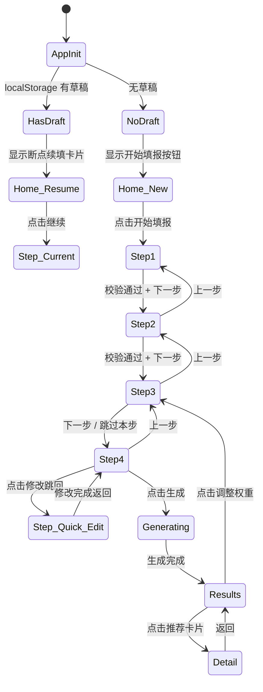
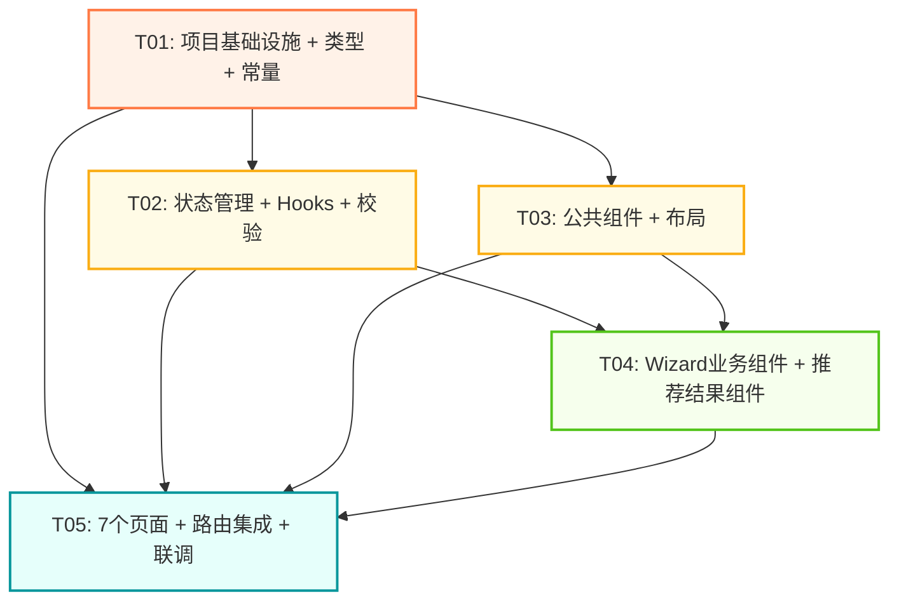

# 高考志愿填报APP — 前端架构设计文档

| 字段 | 内容 |
|------|------|
| 文档版本 | V1.0 |
| 模块 | 前端系统架构 + 任务分解 |
| 架构师 | 高见远（Bob） |
| 日期 | 2026-07-09 |
| 输入 | PRD V1.0、交互原型 Overview |
| 技术栈 | Vite 5 + React 18 + TypeScript + Tailwind CSS + Zustand + react-hook-form + Zod |

---

## 目录

1. [技术栈选型与理由](#1-技术栈选型与理由)
2. [文件结构设计](#2-文件结构设计)
3. [组件设计](#3-组件设计)
4. [状态管理方案](#4-状态管理方案)
5. [路由方案](#5-路由方案)
6. [表单校验方案](#6-表单校验方案)
7. [任务列表](#7-任务列表)
8. [依赖包列表](#8-依赖包列表)
9. [共享知识](#9-共享知识跨文件约定)
10. [待明确事项](#10-待明确事项)

---

## 1. 技术栈选型与理由

### 1.1 构建工具：Vite 5

**理由：**
- 极速冷启动和 HMR，开发体验远超 webpack/CRA
- 原生 ESM 支持，构建产物体积小
- 内置 TypeScript、PostCSS 支持，零额外配置
- 生态成熟，插件丰富，适合移动端 H5 项目

### 1.2 框架：React 18 + TypeScript

**理由：**
- 交互原型已用 React 18 实现，无缝衔接
- TypeScript 为复杂的字段校验逻辑（省份联动、选科非法组合拦截、权重三值之和=100）提供编译期类型保障
- React 18 的 Concurrent Features 和 Automatic Batching 优化高频更新场景（如滑块拖动、位次反查 loading 态切换）

### 1.3 CSS 方案：Tailwind CSS 4 + CSS Variables（Design Tokens）

**理由：**
- **不选 MUI/Ant Design**：原型采用高度定制化的视觉风格（阳光橙渐变、暖白底色、四档暖→冷色阶），使用组件库会与设计稿冲突，改造成本高于从零搭建
- Tailwind 提供原子化样式，开发速度快，且通过 `tailwind.config.ts` 可将 Design Token 映射为语义化类名
- CSS Variables 定义 Design Token（`--color-primary: #FF7A45`），Tailwind 引用变量名，实现设计系统单一数据源
- 移动端优先：Tailwind 的 `max-w-[393px]` 配合 `mx-auto` 实现移动端居中布局

### 1.4 路由：React Router v6

**理由：**
- React 生态标准路由方案，文档完善
- `createBrowserRouter` + 嵌套路由支持 Wizard 分步流程
- 路由守卫可实现"必填字段未完成时阻止前进"的校验逻辑
- 支持 `useNavigate` 编程式导航（Step 4 修改链接跳回对应 Step）

### 1.5 状态管理：Zustand 5（含 persist 中间件）

**理由：**
- **不选 Redux**：本项目状态结构简单（表单数据 + 推荐结果），Redux 样板代码过重
- **不选 Context API**：表单高频更新（每次 blur 触发保存），Context 重渲染性能差
- Zustand 轻量（~1KB），API 简洁，天然支持 `persist` 中间件实现 localStorage 自动持久化
- `persist` 中间件 + `partialize` 可精确控制持久化字段，实现断点续填
- 支持跨组件订阅（`subscribeWithSelector`），用于位次反查结果 → 表单校验联动

### 1.6 表单管理：react-hook-form + Zod

**理由：**
- **react-hook-form**：非受控表单，性能优于受控方案；原生支持 `onBlur` 事件（满足"每字段 blur 自动保存"P0 需求）；`watch` + `trigger` 支持联动校验
- **Zod**：Schema-first 校验库，类型推导自动生成 TypeScript 类型，校验规则与类型定义单一数据源；支持 `.refine()` / `.superRefine()` 实现跨字段联动校验（省份→选科模式、分数→位次偏差>15%）
- 两者通过 `@hookform/resolvers/zod` 无缝集成

### 1.7 动画：Framer Motion

**理由：**
- 推荐结果页四档 Tab 切换、详情页圆环图绘制、loading 轮播文字等场景需要流畅动画
- 原型中的进度条渐变填充、卡片高亮切换等微交互也需动画支撑
- Framer Motion 声明式 API 与 React 范式一致，包体积可控（tree-shaking）

### 1.8 其他工具库

| 库 | 用途 |
|---|------|
| `clsx` | 条件类名拼接（选中/未选中状态切换） |
| `lucide-react` | 轻量图标库（替代原型中的 emoji，可选） |
| `date-fns` | 数据来源日期格式化 |

---

## 2. 文件结构设计

```
src/
├── main.tsx                         # 应用入口，挂载 React Root
├── App.tsx                          # 根组件，定义路由配置
├── index.css                        # 全局样式：Tailwind 指令 + 基础 reset
├── vite-env.d.ts                    # Vite 环境类型声明
│
├── config/
│   └── constants.ts                 # 应用常量：省份列表、科目列表、权重模板、四档配置
│
├── types/
│   ├── form.ts                      # 表单数据类型：FormData, Province, Subject 等
│   ├── recommendation.ts            # 推荐结果类型：Recommendation, Tier, RiskSignal 等
│   └── common.ts                    # 通用类型：ApiResponse, NavState 等
│
├── store/
│   ├── formStore.ts                 # Zustand：表单数据 + Wizard 步骤 + localStorage 持久化
│   └── recommendationStore.ts       # Zustand：推荐结果 + 当前激活档位
│
├── hooks/
│   ├── useFormAutoSave.ts           # 表单自动保存（blur 触发 + 防抖写入 localStorage）
│   ├── useScoreRankLookup.ts        # 分数→位次反查（模拟异步查询 + loading 态管理）
│   └── useSubjectValidation.ts      # 选科组合实时校验（非法组合拦截 + 覆盖率计算）
│
├── utils/
│   ├── validation.ts                # Zod Schema 定义 + 校验工具函数
│   ├── provinceConfig.ts            # 省份配置：3+3 / 3+1+2 模式映射、志愿数、投档规则
│   ├── subjectRules.ts              # 选科规则引擎：合法组合判定、覆盖率计算
│   └── format.ts                    # 格式化工具：数字千分位、日期、百分比
│
├── components/
│   ├── common/
│   │   ├── ProgressBar.tsx          # Wizard 顶部进度条（渐变填充）
│   │   ├── NavBar.tsx               # 通用导航栏（标题 + 返回按钮）
│   │   ├── BottomCTA.tsx            # 底部固定 CTA 区域（带渐变遮罩）
│   │   ├── CardSelector.tsx         # 卡片式选择器（省份、身份、策略、权重模板）
│   │   ├── TagInput.tsx             # 标签式多选输入（专业黑名单、城市、院校层次）
│   │   ├── InfoTip.tsx              # 信息提示横幅（蓝色 info / 金色 warning / 绿色 success）
│   │   ├── LoadingOverlay.tsx       # 全屏加载遮罩（推荐生成 loading 轮播文字）
│   │   └── ActionSheet.tsx          # 底部弹出选择面板（省份选择器）
│   │
│   ├── wizard/
│   │   ├── ProvincePicker.tsx       # 省份选择组件（ActionSheet + 模式标签联动）
│   │   ├── ScoreInput.tsx           # 分数输入组件（数字键盘 + 满分提示 + blur 触发反查）
│   │   ├── RankDisplay.tsx          # 位次反查结果展示卡（loading→结果→手动修改）
│   │   ├── SubjectSelector.tsx      # 选科组合选择器（3+3 六选三 / 3+1+2 首选+再选双区）
│   │   ├── WeightSelector.tsx       # 权重选择器（3 预设模板 + 折叠高级滑块）
│   │   ├── StrategySelector.tsx     # 填报策略选择器（保院校 / 保专业 + 联动权重模板）
│   │   └── PreferenceSection.tsx    # 偏好区域容器（可折叠面板 + 跳过提示）
│   │
│   ├── recommendation/
│   │   ├── TierTabs.tsx             # 冲稳保垫四档 Tab 切换器（暖→冷色阶）
│   │   ├── RecCard.tsx              # 推荐卡片（院校+专业+标签+命中率+风险+AI建议）
│   │   ├── WeightSummaryBar.tsx     # 权重摘要条（固定顶部 + 跳转调整）
│   │   ├── HitRateRing.tsx          # 命中率圆环图（conic-gradient + 档位标识）
│   │   └── RiskSignal.tsx           # 风险信号展示组件（5 种信号类型 + 等级样式）
│   │
│   └── layout/
│       └── AppLayout.tsx            # 应用布局壳（max-w-[393px] 居中 + 安全区域适配）
│
├── pages/
│   ├── HomePage.tsx                 # 首页/启动页
│   ├── Step1BasicInfo.tsx           # Step 1：基础信息
│   ├── Step2Subjects.tsx            # Step 2：选科组合
│   ├── Step3Preferences.tsx         # Step 3：意向偏好
│   ├── Step4Confirm.tsx             # Step 4：确认生成
│   ├── ResultsPage.tsx              # 推荐结果页
│   └── DetailPage.tsx               # 推荐详情页
│
└── styles/
    └── tokens.css                   # Design Token CSS 变量定义
```

**配置文件（项目根目录）：**

```
package.json                         # 依赖声明 + 脚本
vite.config.ts                       # Vite 配置（路径别名 @/ → src/）
tsconfig.json                        # TypeScript 配置
tsconfig.node.json                   # Node 环境 TS 配置（vite.config 用）
tailwind.config.ts                   # Tailwind 配置（Design Token 映射）
postcss.config.js                    # PostCSS 配置（Tailwind + autoprefixer）
index.html                           # HTML 入口（meta viewport 移动端适配）
```

---

## 3. 组件设计

### 3.1 公共组件（components/common/）

#### ProgressBar

```typescript
interface ProgressBarProps {
  step: number;        // 当前步骤（1-4）
  total: number;       // 总步骤数（4）
  label?: string;      // 步骤名称（如"基础信息"）
}
```

#### NavBar

```typescript
interface NavBarProps {
  title: string;
  showBack?: boolean;          // 是否显示返回按钮
  onBack?: () => void;         // 自定义返回回调
  rightSlot?: React.ReactNode; // 右侧自定义内容
}
```

#### BottomCTA

```typescript
interface BottomCTAProps {
  primaryText: string;              // 主按钮文案
  onPrimaryClick: () => void;       // 主按钮回调
  primaryDisabled?: boolean;        // 主按钮是否禁用
  secondaryText?: string;           // 次按钮文案（如"上一步"）
  onSecondaryClick?: () => void;    // 次按钮回调
  skipText?: string;                // 跳过按钮文案（Step 3 专用）
  onSkipClick?: () => void;         // 跳过回调
  hint?: string;                    // 底部提示文字（如"只剩3步"）
  gradient?: boolean;               // 是否渐变按钮（Step 4 生成按钮）
}
```

#### CardSelector

```typescript
interface CardSelectorOption<T> {
  value: T;
  label: string;
  icon?: string;               // emoji 或图标
  desc?: string;               // 描述文字
  badge?: string;              // 角标（如"3+3模式"）
}

interface CardSelectorProps<T> {
  options: CardSelectorOption<T>[];
  value?: T;                   // 当前选中值（单选）
  values?: T[];                // 当前选中值（多选）
  multiple?: boolean;          // 是否多选
  onChange: (value: T | T[]) => void;
  columns?: 1 | 2 | 3;        // 布局列数
  maxSelect?: number;          // 多选时的最大选择数
}
```

#### TagInput

```typescript
interface TagInputProps {
  label: string;
  placeholder?: string;
  tags: string[];                    // 已选标签列表
  onAdd: (tag: string) => void;      // 添加标签
  onRemove: (tag: string) => void;   // 移除标签
  variant?: 'default' | 'danger';    // danger = 专业黑名单红色标签
  maxTags?: number;                  // 最大标签数
  searchable?: boolean;              // 是否启用搜索联想
  searchOptions?: string[];          // 搜索候选列表
}
```

#### InfoTip

```typescript
interface InfoTipProps {
  type: 'info' | 'warning' | 'success' | 'danger';
  icon?: string;              // 默认根据 type 自动选择
  title?: string;             // 可选标题
  children: React.ReactNode;  // 内容
  closable?: boolean;         // 是否可关闭
}
```

#### LoadingOverlay

```typescript
interface LoadingOverlayProps {
  visible: boolean;
  messages?: string[];        // 轮播 loading 文字
  interval?: number;          // 文字切换间隔（ms）
}
```

#### ActionSheet

```typescript
interface ActionSheetOption {
  label: string;
  value: string;
  badge?: string;             // 如"3+3模式"
}

interface ActionSheetProps {
  visible: boolean;
  title?: string;
  options: ActionSheetOption[];
  selectedValue?: string;
  onSelect: (value: string) => void;
  onClose: () => void;
}
```

### 3.2 Wizard 业务组件（components/wizard/）

#### ProvincePicker

```typescript
interface ProvincePickerProps {
  value: string;              // province_code
  onChange: (code: string) => void;
  onModeChange?: (mode: '3+3' | '3+1+2') => void;  // 模式切换回调
}
```

#### ScoreInput

```typescript
interface ScoreInputProps {
  value: number | null;
  onChange: (score: number | null) => void;
  onBlur: () => void;         // blur 触发位次反查
  provinceCode: string;       // 传入省份用于批次线校验
  subjectCategory: string;    // 传入选科类别用于批次线校验
}
```

#### RankDisplay

```typescript
interface RankDisplayProps {
  loading: boolean;               // 反查中
  rank: number | null;            // 自动反查到的位次
  rankRange?: [number, number];   // 位次区间
  sameScoreCount?: number;        // 同分人数
  error?: string;                 // 反查失败信息
  userRank: number | null;        // 用户手动输入的位次
  onUserRankChange: (rank: number | null) => void;
  deviationWarning?: boolean;     // 偏差>15% 警告
}
```

#### SubjectSelector

```typescript
interface SubjectSelectorProps {
  provinceCode: string;           // 决定 3+3 / 3+1+2 模式
  subjectCategory?: string;       // 3+1+2 首选科目
  selectedSubjects: string[];     // 已选科目
  onCategoryChange?: (cat: string) => void;
  onSubjectsChange: (subjects: string[]) => void;
  coverageRate?: number;          // 可报专业覆盖率（P1）
}
```

#### WeightSelector

```typescript
interface WeightSelectorProps {
  mode: 'school_first' | 'major_first' | 'balanced' | 'custom';
  weights: { school: number; major: number; city: number };
  onModeChange: (mode: string) => void;
  onWeightsChange: (weights: { school: number; major: number; city: number }) => void;
}
```

#### StrategySelector

```typescript
interface StrategySelectorProps {
  value: 'school_priority' | 'major_priority';
  onChange: (strategy: string) => void;
  hasMajorPreference: boolean;    // 是否有专业偏好（用于联动提示）
}
```

### 3.3 推荐结果组件（components/recommendation/）

#### TierTabs

```typescript
interface TierTabsProps {
  tiers: Array<{
    key: 'rush' | 'stable' | 'preserve' | 'cushion';
    name: string;             // 冲/稳/保/垫
    count: number;
    hitRate: string;          // 如"10-40%"
  }>;
  activeTier: string;
  onChange: (tier: string) => void;
}
```

#### RecCard

```typescript
interface RecCardProps {
  school: string;
  major: string;
  tags: string[];                  // 院校标签
  tier: 'rush' | 'stable' | 'preserve' | 'cushion';
  hitRate: string;                 // 历史命中率区间
  risks: RiskSignal[];
  aiAdvice: string;
  dataSource: string;
  dataYear: string;
  isNewMajor?: boolean;            // 新增专业标识
  onClick: () => void;             // 点击进入详情
}
```

#### WeightSummaryBar

```typescript
interface WeightSummaryBarProps {
  mode: string;
  weights: { school: number; major: number; city: number };
  onAdjust: () => void;            // 点击跳转权重调整
}
```

#### HitRateRing

```typescript
interface HitRateRingProps {
  hitRate: string;                 // 如"55-65%"
  tier: 'rush' | 'stable' | 'preserve' | 'cushion';
  size?: number;                   // 圆环尺寸（默认 56px）
}
```

### 3.4 布局组件

#### AppLayout

```typescript
interface AppLayoutProps {
  children: React.ReactNode;
  showProgressBar?: boolean;       // Wizard 页面显示进度条
  step?: number;
  total?: number;
  bottomCTA?: React.ReactNode;     // 底部 CTA 区域插槽
}
```

### 3.5 页面组件清单

| 页面 | 路由路径 | 核心组成组件 |
|------|---------|------------|
| HomePage | `/` | NavBar + 信任卡片 + 断点续填卡 + MVP省份提示 + BottomCTA |
| Step1BasicInfo | `/wizard/step1` | ProgressBar + ProvincePicker + ScoreInput + RankDisplay + CardSelector(身份) + InfoTip + BottomCTA |
| Step2Subjects | `/wizard/step2` | ProgressBar + SubjectSelector + InfoTip + BottomCTA |
| Step3Preferences | `/wizard/step3` | ProgressBar + InfoTip(跳过) + TagInput(黑名单) + TagInput(地域) + CardSelector(院校) + WeightSelector + StrategySelector + CardSelector(特殊身份) + BottomCTA(含跳过) |
| Step4Confirm | `/wizard/step4` | ProgressBar + 信息汇总卡(基础+偏好分区) + InfoTip(志愿数) + BottomCTA(生成按钮) |
| ResultsPage | `/results` | NavBar + WeightSummaryBar + TierTabs + RecCard列表 + BottomCTA(调整/重新生成) |
| DetailPage | `/results/detail/:id` | 渐变Header + HitRateRing + 计算依据(可展开) + RiskSignal + AI建议卡 + 院校信息卡 + 数据来源 + BottomCTA(对比/加入志愿表) |

---

## 4. 状态管理方案

### 4.1 全局状态结构

#### formStore（表单数据 + Wizard 状态）

```typescript
interface FormState {
  // —— Wizard 步骤管理 ——
  currentStep: number;              // 1-4
  maxCompletedStep: number;         // 已完成的最大步骤（用于断点续填）
  hasDraft: boolean;                // 是否有未完成的草稿

  // —— Step 1 基础信息 ——
  provinceCode: string | null;      // F-01 省份
  subjectCategory: string | null;   // F-02 选科类别（3+3自动为comprehensive）
  totalScore: number | null;        // F-04 高考总分
  provinceRank: number | null;      // F-05 省位次（自动反查或手动）
  autoRank: number | null;          // 系统反查的位次（用于偏差校验）
  rankRange: [number, number] | null; // 位次区间
  sameScoreCount: number | null;    // 同分人数
  rankLookupStatus: 'idle' | 'loading' | 'success' | 'error';
  fillerRole: 'student' | 'parent'; // F-06 填写者身份

  // —— Step 2 选科 ——
  selectedSubjects: string[];       // F-03 选科组合

  // —— Step 3 偏好 ——
  // P-03 专业偏好
  preferredCategories: string[];    // 倾向学科大类
  preferredMajors: string[];        // 心仪专业
  excludedMajors: string[];         // 专业黑名单
  // P-02 地域偏好
  preferredCities: string[];        // 期望城市
  excludedCities: string[];         // 排斥城市
  preferredEconomicZones: string[]; // 经济圈偏好
  // P-01 院校偏好
  preferredLevels: string[];        // 倾向院校层次
  schoolNature: string[];           // 院校性质
  minSchoolLevel: string;           // 最低院校层次
  // P-04 权重
  weightMode: 'school_first' | 'major_first' | 'balanced' | 'custom';
  schoolWeight: number;
  majorWeight: number;
  cityWeight: number;
  // P-05 策略
  strategyMode: 'school_priority' | 'major_priority';
  // F-07 特殊身份
  specialIdentity: string[];
  nationalityBonusPoints: number | null;
  // F-08 单科成绩
  subjectScores: Record<string, number | null>;

  // —— Actions ——
  setField: <K extends keyof FormState>(key: K, value: FormState[K]) => void;
  setStep: (step: number) => void;
  resetForm: () => void;
  loadDraft: () => void;
}
```

#### recommendationStore（推荐结果）

```typescript
interface RecommendationState {
  recommendations: {
    rush: Recommendation[];
    stable: Recommendation[];
    preserve: Recommendation[];
    cushion: Recommendation[];
  };
  activeTier: 'rush' | 'stable' | 'preserve' | 'cushion';
  totalCount: number;
  generating: boolean;
  generatedAt: string | null;

  setRecommendations: (data: RecommendationState['recommendations']) => void;
  setActiveTier: (tier: RecommendationState['activeTier']) => void;
  setGenerating: (generating: boolean) => void;
}
```

### 4.2 持久化方案

使用 Zustand `persist` 中间件实现 localStorage 自动持久化：

```typescript
// formStore.ts
import { persist } from 'zustand/middleware';

export const useFormStore = create<FormState>()(
  persist(
    (set) => ({
      // ... initial state
      setField: (key, value) => set({ [key]: value } as any),
      // ...
    }),
    {
      name: 'gaokao-form-draft',        // localStorage key
      partialize: (state) => ({
        // 仅持久化表单数据 + 步骤状态，不持久化临时态（如 rankLookupStatus）
        currentStep: state.currentStep,
        maxCompletedStep: state.maxCompletedStep,
        hasDraft: state.hasDraft,
        provinceCode: state.provinceCode,
        subjectCategory: state.subjectCategory,
        totalScore: state.totalScore,
        provinceRank: state.provinceRank,
        fillerRole: state.fillerRole,
        selectedSubjects: state.selectedSubjects,
        preferredCategories: state.preferredCategories,
        preferredMajors: state.preferredMajors,
        excludedMajors: state.excludedMajors,
        preferredCities: state.preferredCities,
        excludedCities: state.excludedCities,
        preferredEconomicZones: state.preferredEconomicZones,
        preferredLevels: state.preferredLevels,
        schoolNature: state.schoolNature,
        minSchoolLevel: state.minSchoolLevel,
        weightMode: state.weightMode,
        schoolWeight: state.schoolWeight,
        majorWeight: state.majorWeight,
        cityWeight: state.cityWeight,
        strategyMode: state.strategyMode,
        specialIdentity: state.specialIdentity,
        nationalityBonusPoints: state.nationalityBonusPoints,
        subjectScores: state.subjectScores,
      }),
    }
  )
);
```

**断点续填逻辑：**
1. 应用启动时，`persist` 中间件自动从 localStorage 恢复状态
2. HomePage 检查 `hasDraft`，若为 `true` 则显示"继续上次填报"卡片
3. 点击卡片跳转到 `currentStep` 对应路由
4. 每个字段 blur 时调用 `setField` 更新状态，`persist` 自动写入 localStorage

### 4.3 状态流转图



---

## 5. 路由方案

### 5.1 路由配置

```typescript
// App.tsx
import { createBrowserRouter, RouterProvider, Navigate } from 'react-router-dom';

const router = createBrowserRouter([
  {
    path: '/',
    element: <AppLayout />,
    children: [
      { index: true, element: <HomePage /> },
      {
        path: 'wizard',
        children: [
          { path: 'step1', element: <Step1BasicInfo /> },
          { path: 'step2', element: <Step2Subjects /> },
          { path: 'step3', element: <Step3Preferences /> },
          { path: 'step4', element: <Step4Confirm /> },
        ],
      },
      { path: 'results', element: <ResultsPage /> },
      { path: 'results/detail/:id', element: <DetailPage /> },
      { path: '*', element: <Navigate to="/" replace /> },
    ],
  },
]);
```

### 5.2 Wizard 前进/后退/跳转修改逻辑

**前进校验（路由守卫）：**

```typescript
// 每步前进前的校验逻辑
function useStepGuard(targetStep: number) {
  const { maxCompletedStep, provinceCode, totalScore, provinceRank, fillerRole, selectedSubjects } = useFormStore();

  const canProceed = (step: number): boolean => {
    switch (step) {
      case 2: // 进入 Step 2 需完成 Step 1
        return !!(provinceCode && totalScore != null && provinceRank != null && fillerRole);
      case 3: // 进入 Step 3 需完成 Step 2
        return !!(provinceCode && selectedSubjects.length > 0);
      case 4: // 进入 Step 4 需完成 Step 3（或跳过）
        return true; // Step 3 可跳过，始终允许
      default:
        return true;
    }
  };

  return canProceed(targetStep);
}
```

**后退：** 始终允许，无条件返回上一步。

**跳转修改（Step 4 → 对应 Step）：** 直接 `navigate('/wizard/stepX')`，修改后返回 Step 4 时数据自动更新（Zustand 全局状态驱动）。

**生成完成后跳转：** `navigate('/results')` 替换路由栈（`replace: true`），防止返回键回到 loading 页。

---

## 6. 表单校验方案

### 6.1 Zod Schema 定义

```typescript
// utils/validation.ts
import { z } from 'zod';

// 省份校验
const provinceSchema = z.enum(['37', '13', '43']);

// 分数校验
const scoreSchema = z.number()
  .int('请输入整数分数')
  .min(0, '分数应在0-750之间')
  .max(750, '分数应在0-750之间');

// 位次校验
const rankSchema = z.number()
  .int('位次应为整数')
  .min(1, '位次应大于0')
  .max(999999, '位次值过大，请检查');

// 选科组合校验（跨字段联动，需 refine）
const subjectSchema = z.object({
  provinceCode: provinceSchema,
  subjectCategory: z.enum(['physics', 'history', 'comprehensive']),
  selectedSubjects: z.array(z.string()),
}).superRefine((data, ctx) => {
  const { provinceCode, selectedSubjects } = data;

  if (provinceCode === '37') {
    // 3+3 模式：选 3 科
    if (selectedSubjects.length !== 3) {
      ctx.addIssue({
        code: z.ZodIssueCode.custom,
        message: `3+3模式需选择3门科目，当前已选${selectedSubjects.length}门`,
        path: ['selectedSubjects'],
      });
    }
    // 重复科目校验
    if (new Set(selectedSubjects).size !== selectedSubjects.length) {
      ctx.addIssue({
        code: z.ZodIssueCode.custom,
        message: '存在重复科目，请重新选择',
        path: ['selectedSubjects'],
      });
    }
  } else {
    // 3+1+2 模式：首选 1 + 再选 2
    const firstSubjects = selectedSubjects.filter(s => s === 'physics' || s === 'history');
    if (firstSubjects.length !== 1) {
      ctx.addIssue({
        code: z.ZodIssueCode.custom,
        message: '首选科目必须且只能选择物理或历史中的1门',
        path: ['selectedSubjects'],
      });
    }
    const secondSubjects = selectedSubjects.filter(s => s !== 'physics' && s !== 'history');
    if (secondSubjects.length !== 2) {
      ctx.addIssue({
        code: z.ZodIssueCode.custom,
        message: '再选科目需选择2门（化学/生物/地理/政治）',
        path: ['selectedSubjects'],
      });
    }
    // 物理历史不能出现在再选
    if (secondSubjects.includes('physics') || secondSubjects.includes('history')) {
      ctx.addIssue({
        code: z.ZodIssueCode.custom,
        message: '物理和历史为首选科目，不能再选为再选科目',
        path: ['selectedSubjects'],
      });
    }
  }
});

// 权重校验
const weightSchema = z.object({
  mode: z.enum(['school_first', 'major_first', 'balanced', 'custom']),
  schoolWeight: z.number().min(0).max(100),
  majorWeight: z.number().min(0).max(100),
  cityWeight: z.number().min(0).max(100),
}).refine(
  (data) => data.mode !== 'custom' || (data.schoolWeight + data.majorWeight + data.cityWeight === 100),
  { message: '权重之和需为100', path: ['schoolWeight'] }
).refine(
  (data) => data.mode !== 'custom' || (data.schoolWeight > 0 || data.majorWeight > 0 || data.cityWeight > 0),
  { message: '至少有一个权重需大于0', path: ['schoolWeight'] }
);

// 完整表单 Schema
const formSchema = z.object({
  provinceCode: provinceSchema,
  subjectCategory: z.enum(['physics', 'history', 'comprehensive']),
  selectedSubjects: z.array(z.string()).min(1),
  totalScore: scoreSchema,
  provinceRank: rankSchema.optional(),
  fillerRole: z.enum(['student', 'parent']),
  // ... 偏好字段（全部 optional）
});
```

### 6.2 联动校验实现

#### 省份 → 选科模式联动

```typescript
// utils/provinceConfig.ts
export function getExamMode(provinceCode: string): '3+3' | '3+1+2' {
  return provinceCode === '37' ? '3+3' : '3+1+2';
}

export function getProvinceConfig(provinceCode: string) {
  const configs = {
    '37': { name: '山东', mode: '3+3', maxVolunteers: 96, volunteerUnit: 'major+school', hasAdjustment: false, checkLevel: 'major' },
    '13': { name: '河北', mode: '3+1+2', maxVolunteers: 96, volunteerUnit: 'major+school', hasAdjustment: false, checkLevel: 'major' },
    '43': { name: '湖南', mode: '3+1+2', maxVolunteers: 45, volunteerUnit: 'major_group', hasAdjustment: true, checkLevel: 'group' },
  };
  return configs[provinceCode];
}
```

**联动逻辑：** 省份选择变更时：
1. 自动设置 `subjectCategory`（山东 → `comprehensive`，其他 → 清空等待用户选择）
2. 清空 `selectedSubjects`（弹出确认框"切换省份将清空选科"）
3. 更新省份提示文案

#### 分数 → 位次反查联动

```typescript
// hooks/useScoreRankLookup.ts
export function useScoreRankLookup() {
  const { totalScore, provinceCode, subjectCategory } = useFormStore();
  const setField = useFormStore((s) => s.setField);

  useEffect(() => {
    if (!totalScore || !provinceCode || !subjectCategory) return;

    setField('rankLookupStatus', 'loading');

    // 模拟异步查询一分一段表
    const timer = setTimeout(() => {
      const result = mockScoreRankLookup(provinceCode, subjectCategory, totalScore);
      if (result) {
        setField('autoRank', result.cumulativeCount);
        setField('provinceRank', result.cumulativeCount);
        setField('rankRange', [result.cumulativeCount - result.countAtScore + 1, result.cumulativeCount]);
        setField('sameScoreCount', result.countAtScore);
        setField('rankLookupStatus', 'success');
      } else {
        setField('rankLookupStatus', 'error');
      }
    }, 1200);

    return () => clearTimeout(timer);
  }, [totalScore, provinceCode, subjectCategory]);
}
```

#### 位次偏差校验

```typescript
// 实时校验：用户手动输入位次与系统反查偏差 > 15%
const rankDeviation = autoRank && userRank
  ? Math.abs(userRank - autoRank) / autoRank
  : 0;
const showDeviationWarning = rankDeviation > 0.15;
```

### 6.3 实时拦截 vs 提交校验

| 校验类型 | 触发时机 | 实现方式 | 示例 |
|---------|---------|---------|------|
| **实时拦截** | onChange | 组件内即时判定，阻止非法状态 | 选科数量超限（选满后变灰）、物理历史不能混选、权重三值之和≠100 |
| **blur 校验** | onBlur | react-hook-form `mode: 'onBlur'` + Zod | 分数范围 0-750、位次 > 0 |
| **提交校验** | 下一步按钮点击 | `handleSubmit` + Zod 全量校验 | Step 1→2 前置校验（4 个必填字段全部通过） |
| **联动校验** | 依赖字段变更 | `watch` + `trigger` 手动触发 | 省份切换→清空选科、分数变更→重新反查位次、策略切换→推荐权重模板 |

---

## 7. 任务列表

以下任务按实现顺序排列，每个任务至少包含 3 个文件，总任务数 5 个。

```json
[
  {
    "id": "T01",
    "name": "项目基础设施 + 类型定义 + 常量配置",
    "description": "搭建项目骨架：Vite + React 18 + TypeScript + Tailwind CSS 工程化配置；定义全局 Design Token CSS 变量；编写所有 TypeScript 类型定义（表单数据、推荐结果、通用类型）；编写应用常量配置（省份列表、科目列表、权重模板、四档配置）和省份规则配置（3+3 / 3+1+2 模式映射、志愿数、投档规则）。这是所有后续任务的基础。",
    "dependencies": [],
    "files": [
      "package.json",
      "vite.config.ts",
      "tsconfig.json",
      "tsconfig.node.json",
      "tailwind.config.ts",
      "postcss.config.js",
      "index.html",
      "src/main.tsx",
      "src/App.tsx",
      "src/index.css",
      "src/vite-env.d.ts",
      "src/styles/tokens.css",
      "src/config/constants.ts",
      "src/types/form.ts",
      "src/types/recommendation.ts",
      "src/types/common.ts",
      "src/utils/provinceConfig.ts",
      "src/utils/format.ts"
    ],
    "priority": "P0"
  },
  {
    "id": "T02",
    "name": "状态管理 + Hooks + 校验引擎",
    "description": "实现核心数据层：Zustand formStore（表单数据 + Wizard 步骤 + localStorage 持久化 + 断点续填）、recommendationStore（推荐结果 + 激活档位）；编写 Zod 校验 Schema（分数范围、选科非法组合拦截、权重三值之和=100、位次偏差>15%）；实现三个关键 Hooks：useFormAutoSave（blur 自动保存）、useScoreRankLookup（分数→位次反查 + loading 态）、useSubjectValidation（选科组合实时校验 + 覆盖率计算）；编写选科规则引擎 subjectRules（合法组合判定、非法组合拦截逻辑）。",
    "dependencies": ["T01"],
    "files": [
      "src/store/formStore.ts",
      "src/store/recommendationStore.ts",
      "src/hooks/useFormAutoSave.ts",
      "src/hooks/useScoreRankLookup.ts",
      "src/hooks/useSubjectValidation.ts",
      "src/utils/validation.ts",
      "src/utils/subjectRules.ts"
    ],
    "priority": "P0"
  },
  {
    "id": "T03",
    "name": "公共组件 + 布局组件",
    "description": "实现全部公共通用组件和布局壳：ProgressBar（Wizard 渐变进度条）、NavBar（导航栏）、BottomCTA（底部固定 CTA 区域带渐变遮罩）、CardSelector（卡片式选择器，支持单选/多选/列数配置/最大选择数）、TagInput（标签式多选输入，支持 danger 变体用于专业黑名单）、InfoTip（四种类型信息提示横幅）、LoadingOverlay（全屏加载遮罩 + 轮播文字）、ActionSheet（底部弹出选择面板）；AppLayout 布局壳（max-w-[393px] 居中 + 安全区域适配 + 进度条插槽 + 底部 CTA 插槽）。所有组件严格遵循 Design Token 和原型视觉规范。",
    "dependencies": ["T01"],
    "files": [
      "src/components/layout/AppLayout.tsx",
      "src/components/common/ProgressBar.tsx",
      "src/components/common/NavBar.tsx",
      "src/components/common/BottomCTA.tsx",
      "src/components/common/CardSelector.tsx",
      "src/components/common/TagInput.tsx",
      "src/components/common/InfoTip.tsx",
      "src/components/common/LoadingOverlay.tsx",
      "src/components/common/ActionSheet.tsx"
    ],
    "priority": "P0"
  },
  {
    "id": "T04",
    "name": "Wizard 业务组件 + 推荐结果组件",
    "description": "实现两大业务域的全部组件：Wizard 域——ProvincePicker（省份选择 + ActionSheet + 模式标签联动）、ScoreInput（数字输入 + 满分提示 + blur 触发反查）、RankDisplay（loading→结果→手动修改 + 偏差警告）、SubjectSelector（3+3 六选三 / 3+1+2 首选+再选双区 + 选满变灰 + 覆盖率）、WeightSelector（3 预设模板 + 折叠高级滑块 + 权重和=100 校验）、StrategySelector（保院校/保专业 + 联动权重模板）、PreferenceSection（可折叠偏好面板）；推荐结果域——TierTabs（冲稳保垫四档暖→冷色阶 Tab）、RecCard（院校+专业+标签+命中率+风险信号+AI建议+数据来源）、WeightSummaryBar（固定顶部权重摘要 + 跳转调整）、HitRateRing（conic-gradient 圆环图 + 档位标识）、RiskSignal（5 种风险信号类型 + 等级样式）。",
    "dependencies": ["T01", "T02", "T03"],
    "files": [
      "src/components/wizard/ProvincePicker.tsx",
      "src/components/wizard/ScoreInput.tsx",
      "src/components/wizard/RankDisplay.tsx",
      "src/components/wizard/SubjectSelector.tsx",
      "src/components/wizard/WeightSelector.tsx",
      "src/components/wizard/StrategySelector.tsx",
      "src/components/wizard/PreferenceSection.tsx",
      "src/components/recommendation/TierTabs.tsx",
      "src/components/recommendation/RecCard.tsx",
      "src/components/recommendation/WeightSummaryBar.tsx",
      "src/components/recommendation/HitRateRing.tsx",
      "src/components/recommendation/RiskSignal.tsx"
    ],
    "priority": "P0"
  },
  {
    "id": "T05",
    "name": "7个页面实现 + 路由集成 + 最终联调",
    "description": "实现全部 7 个页面并完成路由集成：HomePage（Hero 区 + 信任卡片 + 断点续填卡 + MVP 省份提示 + CTA）、Step1BasicInfo（省份选择 + 分数输入 + 位次反查卡 + 身份选择 + 省份提示 + 前置校验）、Step2Subjects（根据省份动态渲染 3+3 / 3+1+2 选科 UI + 覆盖率 + 省份提示）、Step3Preferences（跳过提示 + 黑名单 + 地域 + 院校 + 权重 + 策略 + 特殊身份 + 跳过按钮）、Step4Confirm（基础+偏好分区信息汇总卡 + 修改跳转 + 志愿数提示 + 生成按钮 + loading 轮播）、ResultsPage（Header + 权重摘要条 + 四档 Tab + 推荐卡片列表 + 底部操作）、DetailPage（渐变 Header + 命中率圆环 + 计算依据可展开 + 风险信号 + AI 建议 + 院校信息 + 数据来源 + 底部操作）；配置 React Router 路由表 + 前进校验路由守卫；完成全流程联调（断点续填、自动保存、联动校验、页面跳转）。",
    "dependencies": ["T01", "T02", "T03", "T04"],
    "files": [
      "src/pages/HomePage.tsx",
      "src/pages/Step1BasicInfo.tsx",
      "src/pages/Step2Subjects.tsx",
      "src/pages/Step3Preferences.tsx",
      "src/pages/Step4Confirm.tsx",
      "src/pages/ResultsPage.tsx",
      "src/pages/DetailPage.tsx"
    ],
    "priority": "P0"
  }
]
```

### 任务依赖图



---

## 8. 依赖包列表

```json
[
  { "name": "react", "version": "^18.3.1", "purpose": "UI 框架" },
  { "name": "react-dom", "version": "^18.3.1", "purpose": "React DOM 渲染" },
  { "name": "react-router-dom", "version": "^6.26.0", "purpose": "客户端路由（Wizard 分步流程 + 页面跳转）" },
  { "name": "zustand", "version": "^5.0.0", "purpose": "全局状态管理（表单数据 + 推荐结果 + localStorage 持久化）" },
  { "name": "react-hook-form", "version": "^7.53.0", "purpose": "表单管理（blur 自动保存 + 联动校验 + 提交校验）" },
  { "name": "@hookform/resolvers", "version": "^3.9.0", "purpose": "react-hook-form 与 Zod 的桥接适配器" },
  { "name": "zod", "version": "^3.23.8", "purpose": "Schema 校验（分数范围、选科非法组合、权重三值之和、位次偏差）" },
  { "name": "framer-motion", "version": "^11.5.0", "purpose": "动画（Tab 切换、圆环图绘制、loading 轮播、进度条填充）" },
  { "name": "clsx", "version": "^2.1.1", "purpose": "条件类名拼接（选中/未选中状态切换）" },
  { "name": "date-fns", "version": "^3.6.0", "purpose": "数据来源日期格式化" },
  { "name": "lucide-react", "version": "^0.439.0", "purpose": "轻量图标库（可选，替代部分 emoji）" },
  { "name": "typescript", "version": "^5.6.0", "purpose": "TypeScript 编译器（devDependency）" },
  { "name": "vite", "version": "^5.4.0", "purpose": "构建工具 + 开发服务器（devDependency）" },
  { "name": "@vitejs/plugin-react", "version": "^4.3.0", "purpose": "Vite React 插件（devDependency）" },
  { "name": "tailwindcss", "version": "^4.0.0", "purpose": "原子化 CSS 框架（devDependency）" },
  { "name": "postcss", "version": "^8.4.0", "purpose": "CSS 后处理器（devDependency）" },
  { "name": "autoprefixer", "version": "^10.4.0", "purpose": "CSS 自动添加浏览器前缀（devDependency）" },
  { "name": "@types/react", "version": "^18.3.0", "purpose": "React 类型定义（devDependency）" },
  { "name": "@types/react-dom", "version": "^18.3.0", "purpose": "React DOM 类型定义（devDependency）" }
]
```

---

## 9. 共享知识（跨文件约定）

### 9.1 命名规范

| 类别 | 规范 | 示例 |
|------|------|------|
| 文件名 | 组件用 PascalCase，工具/配置用 camelCase | `ProvincePicker.tsx` / `formStore.ts` |
| 组件名 | PascalCase | `ProgressBar`, `RecCard` |
| Hook 名 | use 前缀 + camelCase | `useFormAutoSave`, `useScoreRankLookup` |
| Store 名 | use 前缀 + Store 后缀 | `useFormStore`, `useRecommendationStore` |
| 类型名 | PascalCase | `FormData`, `Recommendation`, `RiskSignal` |
| CSS 变量 | --category-name | `--color-primary`, `--color-rush` |
| Tailwind 类名 | 语义化映射 | `bg-primary`, `text-rush`, `rounded-card` |
| 路由路径 | kebab-case | `/wizard/step1`, `/results/detail/:id` |

### 9.2 Design Token 使用约定

所有颜色通过 CSS Variables 定义在 `src/styles/tokens.css`，Tailwind Config 引用变量名：

```css
/* tokens.css */
:root {
  /* 主色系 */
  --color-primary: #FF7A45;
  --color-primary-light: #FFF2E8;
  --color-primary-dark: #D4380D;

  /* 辅助色 */
  --color-gold: #FAAD14;
  --color-gold-light: #FFFBE6;
  --color-green: #52C41A;
  --color-green-light: #F6FFED;
  --color-green-dark: #389E0D;
  --color-blue: #1890FF;
  --color-blue-light: #E6F7FF;
  --color-red: #FF4D4F;
  --color-red-light: #FFF1F0;
  --color-teal: #08979C;
  --color-teal-light: #E6FFFB;

  /* 中性色 */
  --color-bg: #FFF9F5;
  --color-surface: #FFFFFF;
  --color-text-1: #262626;
  --color-text-2: #8C8C8C;
  --color-text-3: #BFBFBF;
  --color-border: #F0F0F0;
  --color-divider: #F5F5F5;

  /* 四档颜色 */
  --color-rush: #FF6B35;
  --color-rush-bg: #FFF3ED;
  --color-stable: #FAAD14;
  --color-stable-bg: #FFFBE6;
  --color-preserve: #52C41A;
  --color-preserve-bg: #F6FFED;
  --color-cushion: #08979C;
  --color-cushion-bg: #E6FFFB;

  /* 圆角 */
  --radius-card: 16px;
  --radius-button: 26px;
  --radius-tag: 8px;
  --radius-input: 12px;
}
```

```typescript
// tailwind.config.ts — 引用 CSS 变量
export default {
  theme: {
    extend: {
      colors: {
        primary: { DEFAULT: 'var(--color-primary)', light: 'var(--color-primary-light)', dark: 'var(--color-primary-dark)' },
        gold: { DEFAULT: 'var(--color-gold)', light: 'var(--color-gold-light)' },
        green: { DEFAULT: 'var(--color-green)', light: 'var(--color-green-light)', dark: 'var(--color-green-dark)' },
        blue: { DEFAULT: 'var(--color-blue)', light: 'var(--color-blue-light)' },
        red: { DEFAULT: 'var(--color-red)', light: 'var(--color-red-light)' },
        teal: { DEFAULT: 'var(--color-teal)', light: 'var(--color-teal-light)' },
        rush: { DEFAULT: 'var(--color-rush)', bg: 'var(--color-rush-bg)' },
        stable: { DEFAULT: 'var(--color-stable)', bg: 'var(--color-stable-bg)' },
        preserve: { DEFAULT: 'var(--color-preserve)', bg: 'var(--color-preserve-bg)' },
        cushion: { DEFAULT: 'var(--color-cushion)', bg: 'var(--color-cushion-bg)' },
        bg: 'var(--color-bg)',
        surface: 'var(--color-surface)',
      },
      textColor: {
        1: 'var(--color-text-1)',
        2: 'var(--color-text-2)',
        3: 'var(--color-text-3)',
      },
      borderColor: {
        DEFAULT: 'var(--color-border)',
        divider: 'var(--color-divider)',
      },
      borderRadius: {
        card: 'var(--radius-card)',
        button: 'var(--radius-button)',
        tag: 'var(--radius-tag)',
        input: 'var(--radius-input)',
      },
    },
  },
};
```

**使用约定：**
- 禁止在组件中硬编码颜色值（如 `#FF7A45`），必须使用 Tailwind 语义类名（如 `bg-primary`）或 CSS 变量
- 四档颜色统一使用 `rush` / `stable` / `preserve` / `cushion` 语义名，不使用"橙""黄""绿""青"
- 渐变按钮统一使用 `bg-gradient-to-br from-primary to-gold`

### 9.3 组件 Props 设计约定

1. **受控优先**：所有表单组件为受控组件，value + onChange 模式
2. **回调命名**：事件回调统一使用 `on` 前缀（`onChange`, `onBlur`, `onSelect`, `onClose`）
3. **可选 props 提供默认值**：如 `columns = 2`, `variant = 'default'`
4. **复合组件用 children**：布局类组件用 `children` 而非 `content` prop
5. **Slot 模式**：需要自定义插入内容的区域用 `xxxSlot?: React.ReactNode`（如 `rightSlot`）
6. **泛型选择器**：`CardSelector<T>` 支持任意值类型，不硬编码 string

### 9.4 类型定义约定

1. **字段编号映射**：PRD 中的字段编号（F-01, P-03 等）在类型注释中标注，便于溯源
2. **枚举用字面量联合类型**：`type Tier = 'rush' | 'stable' | 'preserve' | 'cushion'`，不用 enum（利于 tree-shaking）
3. **可选字段用 `| null`**：不用 `?`，统一用 `T | null` 表示"有值或无值"，避免 `undefined` 与"未设置"混淆
4. **API 响应格式**：统一 `{ code: number; data: T; message: string }`，前端只消费 `data`
5. **日期格式**：所有日期存储为 ISO 8601 UTC 字符串，展示时用 `date-fns` 格式化

### 9.5 移动端适配约定

1. **设计宽度**：以 393px（iPhone 15 Pro）为基准设计，`max-w-[393px] mx-auto`
2. **安全区域**：底部 CTA 使用 `pb-[env(safe-area-inset-bottom)]` 适配 iPhone 底部安全区
3. **触摸目标**：所有可点击元素最小高度 44px（Apple HIG 标准）
4. **输入框**：`inputmode="numeric"` 唤起数字键盘（分数、位次输入）
5. **禁止缩放**：`<meta name="viewport" content="width=device-width, initial-scale=1.0, maximum-scale=1.0, user-scalable=no">`

---

## 10. 待明确事项

| 编号 | 问题 | 影响范围 | 建议决策方 |
|------|------|---------|-----------|
| Q-01 | 后端 API 契约尚未定义，前端是否先用 Mock 数据开发？推荐生成接口的请求/响应结构需要与后端对齐 | T02 recommendationStore、T05 ResultsPage/DetailPage | 产品 + 后端 |
| Q-02 | 位次反查接口（一分一段表查询）是否由后端提供 API，还是前端内置静态数据表？MVP 三省数据量不大，可前端内置 JSON | T02 useScoreRankLookup | 后端 + 数据 |
| Q-03 | PRD Q-01：当年一分一段表未发布时如何处理？前端是否需要"使用上年数据估算并标注"的 UI 状态？ | T03 RankDisplay 组件 | 产品 + 数据 |
| Q-04 | 推荐结果列表较长（稳档 58 个），是否需要分页/无限滚动/筛选器？原型中有"下拉加载"提示但未定义交互细节 | T05 ResultsPage | 产品 + 设计 |
| Q-05 | 权重调节后"点击应用 1-2 秒刷新"的交互，loading 动画是在当前页面内展示还是全屏遮罩？ | T04 WeightSelector、T05 Step3 | 设计 |
| Q-06 | Step 3 偏好页内容较多（原型审查也提到"建议用折叠面板"），是否将各偏好模块设计为可折叠手风琴？还是保持原型中的平铺滚动？ | T04 PreferenceSection、T05 Step3Preferences | 产品 + 设计 |
| Q-07 | 是否需要埋点/数据分析 SDK 集成（如用户 funnel 转化率、字段填写时长、推荐生成成功率）？ | T01 项目基础设施 | 产品 |
| Q-08 | 推荐详情页的"加入志愿表"功能是否在 MVP 范围内？PRD Non-goals NG-07 提到"不做志愿填报模拟器"，但详情页底部有"加入志愿表"按钮 | T05 DetailPage | 产品 |

---

*架构设计完成。本文档由架构师高见远（Bob）基于 PRD V1.0 和交互原型 Overview 撰写。*
