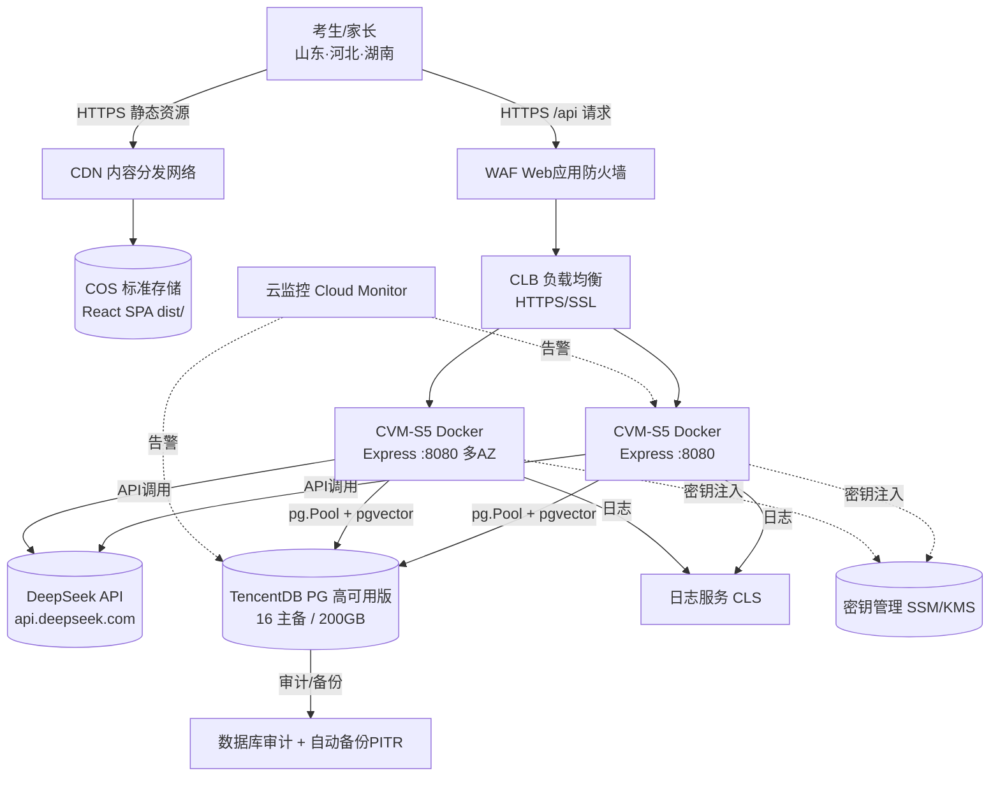

# 高考志愿填报APP（含RAG）· 腾讯云部署指南（主交付文档）

> 本文由**首席技术支持官**整合两部分产出：
> 1. **CloudQ（腾讯云架构专家）** 的《腾讯云部署架构方案》全文（产品选型 / 拓扑 / TCO / 步骤 / 风险 / 本项目注意点）；
> 2. **已为你生成并可立即使用的部署文件**（`backend/Dockerfile`、`deploy/nginx.conf`、`deploy/docker-compose.prod.yml`、`.env.prod.example`、CI 示例等，后端 `tsc` 已验证零报错）。
>
> ⚠️ **环境说明**：CloudQ 前置环境检测 `check_env.py` 返回 exit code 2（本机未配置腾讯云 AK/SK 或 OAuth 凭证），因此其**实时治理能力**（智能顾问架构评估、资源盘点、成本监测、AIOps 巡检）暂不可用。本文架构基于**标准腾讯云最佳实践**，价格均为包年包月公开价估算，**最终以官网报价器为准**。上线后配置 CloudQ 凭证即可开启持续治理。

---

## 一、推荐架构组合

| 层 | 推荐产品 | 说明 |
|----|---------|------|
| 前端 | **COS 标准存储 + CDN**（生产）/ 单台 CVM 上 Nginx 托管（快速上线） | SPA 静态资源；CDN 边缘加速三省用户 |
| 后端 | **CVM 标准型 S5（4核8G 起步，MVP 可 2核4G）+ Docker** | 最贴合现有 docker-compose 工作流，长连接 `pg.Pool` 稳定 |
| 数据库 | **云数据库 PostgreSQL（TencentDB for PostgreSQL）高可用版 16，4核8G + 200GB** | 全托管、自动备份+PITR、主备跨 AZ 切换；版本与本地一致，迁移零兼容风险 |
| 大模型 | **后端直连 DeepSeek API** + **密钥管理 SSM/KMS** 注入，**不进仓库/镜像** | 保留项目原有规则引擎降级；RAG 向量优先用 PG `pgvector` |
| 入口 | **CLB + WAF + 免费 DV SSL**（生产） | API 多实例负载 + Web 防护 + HTTPS |
| 可观测 | **CLS 日志服务 + 云监控 Cloud Monitor 告警** | 替代本地文件日志，满足等保审计留存 |
| 合规 | **VPC + 安全组 + 堡垒机 + 数据库审计 + KMS + CAM 最小权限** | 等保三级落地路径 |

**一句话**：前端 COS+CDN ｜ 后端 CVM-S5 + Docker ｜ 数据库 TencentDB PG 高可用版 16 ｜ DeepSeek 直连 + SSM 托管密钥 ｜ CLB+WAF+SSL 入口 ｜ CLS+监控 ｜ 等保走 VPC+堡垒机+审计+KMS。

---

## 二、架构拓扑图



> 静态走 CDN→COS（边缘加速）；API 走 WAF→CLB→多 CVM（跨 AZ）；DB 主备跨 AZ；密钥运行期注入；日志/监控/审计全覆盖。

---

## 三、成本估算（TCO，包年包月，MVP 几万~十万用户）

> 单位：人民币；价格为公开价估算，包年通常 7–8 折；以官网实时报价为准。

### 最低成本方案（预算极紧的 MVP 验证）
| 组件 | 规格 | 月费(估) | 年费(估) |
|------|------|---------|---------|
| 轻量应用服务器 Lighthouse | 2核4G / 60GB | ¥80 | ¥960 |
| TencentDB PG 基础版 | 2核4G / 100GB 单节点 | ¥220 | ¥2,640 |
| COS 标准存储 | ~10GB | ¥2 | ¥24 |
| CDN 流量 | ~200GB/月 | ¥50 | ¥600 |
| SSL 免费 DV | — | ¥0 | ¥0 |
| **合计** | | **≈¥352/月** | **≈¥4,224/年** |

### 推荐方案（生产可用：HA + 安全 + 可观测）
| 组件 | 规格 | 月费(估) | 年费(估) |
|------|------|---------|---------|
| CVM 标准型 S5 | 4核8G（MVP 可 2核4G） | ¥300–500 | ¥3,600–6,000 |
| TencentDB PG 高可用版 | 4核8G / 200GB 双节点 | ¥900–1,300 | ¥10,800–15,600 |
| CLB | 共享型 / 性能容量型 | ¥20–200 | ¥240–2,400 |
| CDN 流量 | ~300GB/月 | ¥80–150 | ¥960–1,800 |
| COS 标准存储 | ~10GB | ¥2 | ¥24 |
| WAF | 入门/基础版 | ¥380–680 | ¥4,560–8,160 |
| CLS 日志服务 | 数十 GB | ¥50–150 | ¥600–1,800 |
| KMS / 密钥管理 | — | ¥30–100 | ¥360–1,200 |
| SSL 证书 | 免费 DV 或 OV（等保建议 OV） | ¥0–200/年 | — |
| **合计** | | **≈¥1,800–3,300/月** | **≈¥2.1万–3.9万/年** |

### ⚠️ 峰值提示（高考季 6–7 月）
志愿填报流量高度季节化，峰值可达平时数倍。需预留临时升配（CVM/DB 升规格）或增购 CDN 流量包，预计 **+¥500–1,500/月**；建议 **5 月前完成压测与扩容预案**。

---

## 四、两条部署路径与决策（重要）

本项目前端调用的是**相对路径** `/api/v1/...`（`src/data/auth.ts`、`src/data/dynamic/index.ts` 均用 `fetch('/api/v1/...')`），**不是** `import.meta.env` 写死的绝对地址。这一事实带来一个关键差异：

| 路径 | 做法 | 前端是否要改代码 | 适用 |
|------|------|----------------|------|
| **Path B（推荐先走·快速上线）** | 单台 CVM 上 `docker compose` 跑 `api`(后端) + `web`(Nginx)；Nginx 托管 `dist/` 并反代 `/api` → 后端 | **零改动** | MVP / 立即上线 / 验证 |
| **Path A（CloudQ 推荐·生产拆分）** | 前端 `dist/` 传 COS+CDN；后端 CVM/TKE 挂 CLB+WAF；前端需调绝对 API 地址 `https://api.yourdomain.com/api` | 需加运行时配置（见第八节） | 规模化 / 高并发 / 等保 |

> **结论**：想"马上跑起来"，用 **Path B**——我已生成的 `deploy/` 文件就是这条路径，开箱即用、不碰前端代码。等业务起来、要做等保与高并发时，再切 **Path A**（把前端搬到 COS+CDN，后端加 CLB+WAF）。两条路数据库都是 TencentDB PG，迁移一致。

---

## 五、已生成的部署文件（Path B 开箱即用）

| 文件 | 作用 |
|------|------|
| `backend/Dockerfile` | 后端多阶段构建（Node 20，含 `/health` 健康检查）；已验证 `tsc` 编译零报错 |
| `backend/.dockerignore` | 排除 `node_modules`/`.env`/日志，避免密钥进镜像 |
| `deploy/nginx.conf` | 托管前端 `dist/` + 反代 `/api/` → `api:8080`（LLM 超时留 70s 余量） |
| `deploy/docker-compose.prod.yml` | 编排 `api` + `web`；数据库默认用 TencentDB（含可选本地 PG 注释） |
| `deploy/.env.prod.example` | 生产环境变量模板（DATABASE_URL / DeepSeek Key 等） |
| `deploy/DEPLOY.md` | 实操命令清单（快速上手） |
| `deploy/ci-github-actions.example.yml` | 可选 GitHub Actions 自动部署流水线 |

### Path B 快速上手（3 步）
```bash
# 1) 在本机/CI 构建前端产物
npm install && npm run build        # 生成 dist/

# 2) 在服务器上：复制 deploy/ 目录，准备环境变量
cd deploy
cp .env.prod.example .env.prod
vim .env.prod                       # 填入 TencentDB 连接串、DeepSeek Key、真实域名

# 3) 启动（数据库用云数据库，无需本地 PG）
docker compose -f docker-compose.prod.yml up -d --build
```
> 浏览器访问 `http://<服务器IP>/` 即可；API 在 `/api/v1`。如需 HTTPS，放 SSL 证书并改 `nginx.conf` 监听 443（也可前置 CLB/WAF）。

---

## 六、数据库迁移（PostgreSQL Docker → TencentDB）

1. **建库**：控制台创建 TencentDB for PostgreSQL **16 高可用版**（4核8G/200GB），字符集 UTF8、时区 `Asia/Shanghai`，白名单仅放 VPC 内 CVM，开启自动备份 + PITR。
2. **导出**：本地 `pg_dump -Fc -h localhost -U gaokao gaokao_db > gaokao.dump`（含 7 张表 + 604 行种子 + 索引）。
3. **导入**：`pg_restore -h <TencentDB内网地址> -U gaokao -d gaokao_db gaokao.dump`；追求近零停机可用 **DTS 数据传输服务**。
4. **扩展**：若用 `pgvector`，先在目标库 `CREATE EXTENSION vector;`（确认版本支持）。
5. **连接池**：`pg.Pool` 的 `max` 必须小于实例 `max_connections`；高并发前置 **pgBouncer（事务池）**；设 `idleTimeout`/`connectionTimeout` 防连接泄漏。
6. **校验**：表数/行数/索引核对；跑核心查询 + RAG 向量召回；做一次备份恢复演练。

---

## 七、DeepSeek 密钥安全（严禁明文进仓库）

- `.env` 已加入 `.gitignore`（`backend/.dockerignore` 也排除），**绝不**把 `DEEPSEEK_API_KEY` 提交 Git 或打进镜像。
- 云上：密钥存 **SSM/密钥管理**，容器启动时由部署平台注入环境变量（不进镜像层、不进代码）。
- 定期轮换；一旦疑似泄露，立即在 DeepSeek 控制台吊销并重发。
- 可选 **API 网关** 作统一出口，集中限流/审计/密钥托管。
- 保留 `LLM_TIMEOUT=60000ms` 与规则引擎降级，防模型抖动拖垮接口。

---

## 八、前端 API 地址切换

- **Path B（Nginx 反代）**：前端用相对 `/api/v1`，无需任何改动，Nginx 自动反代。✅
- **Path A（COS+CDN 静态托管）**：SPA 无法反代，前端必须知道绝对 API 地址。推荐**运行时配置**（免重新构建）：
  - 在 COS 放 `config.js`：`window.__APP_CONFIG__ = { API_BASE: 'https://api.yourdomain.com/api' }`，`index.html` 中 `<script src="/config.js"></script>` 引入；
  - 前端把 `fetch('/api/v1/...')` 改为 `fetch(\`${window.__APP_CONFIG__.API_BASE}/v1/...\`)`。
  - 这样换域名只需改 `config.js`，不必重新 `npm run build`。
- **SPA 路由**：COS+CDN 需配置"索引文档/错误页 = index.html"实现 history fallback（刷新不 404）；CloudBase 原生支持。
- `vite dev` 的 `/api → localhost:8080` 代理仅本地有效；生产由 Nginx 反代或绝对地址接管。

---

## 九、风险评估与高可用

| 风险 | 影响 | 建议 |
|------|------|------|
| 单 CVM 故障 | API 全断 | CLB + ≥2 台 CVM 跨可用区；或转 TKE 多副本 |
| DB 单点 | 数据/服务不可用 | TencentDB 高可用版主备跨 AZ + 自动切换 + PITR |
| 高考季尖峰 | 雪崩/超时 | CDN 卸载静态；CLB 弹性；5 月前压测；峰值临时升配；SCF 作 API 弹性补充 |
| PII 泄露（等保三级） | 合规/法律风险 | KMS 字段级加密 + 库 TDE + TLS1.2+；最小采集+授权 |
| 密钥泄露 | 资损/滥用 | SSM 托管 + 定期轮换 + 泄露即吊销 |
| 成本失控 | 预算超支 | 费用中心预算告警；CDN 流量包；按需升配 |
| 日志丢失 | 排查困难 | 本地文件 → CLS 集中化长期留存 |
| 迁移不一致 | 功能异常 | 迁移后全量校验 + 召回验证 + 备份演练 |

**高可用目标**：API 层 CLB 多 AZ 多实例无单点；DB 主备自动切换（RTO 分钟级）；静态 CDN 多边缘；备份可恢复（定期演练）。

---

## 十、等保三级落地路径

VPC 隔离 + 安全组最小化 + WAF + 堡垒机 + 数据库审计 + CLS 审计日志 + KMS 加密 + CAM 最小权限 + 定期漏扫。若 6 月上线且涉考生 PII，等保三级应尽早启动（WAF/审计/堡垒机/KMS 有交付周期）。参考腾讯云"等保合规"一站式服务。

---

## 十一、CI/CD

- **GitHub Actions**（已附 `deploy/ci-github-actions.example.yml`）：推送 `main` → 构建前端 → SCP 文件到服务器 → `docker compose up -d --build` → 清理旧镜像。
- 密钥用仓库 Secrets（HOST/USER/SSH_KEY/DEPLOY_PATH）；`.env.prod` **不进仓库**，预置于服务器。
- 进阶：镜像推 **TCR 容器镜像服务**，CVM/TKE 拉取更新；前端构建后自动传 COS + CDN 刷新。

---

## 十二、已确认决策 / 下一步

> ✅ **用户已确认**：地域 = **上海（华东 ap-shanghai）**；路径 = **Path B（单台 CVM + Docker，零改前端快速上线）**。
> 上海 Path B 的逐条执行步骤见 **`deploy/SHANGHAI-PATHB-RUNBOOK.md`**（购买清单 / VPC / 数据库 / 上传 / 启动 / HTTPS / 上线清单）。

1. **主地域**：已定 **上海 ap-shanghai**（试点三省近北京/广州，单地域最简，静态由 CDN 覆盖时也无碍）。
2. **路径**：已定 **Path B**；业务起量后再平滑升级到 Path A（CLB+WAF / COS+CDN，见第四、九节）。
3. **凭证打通**：配置 CloudQ（OAuth 或子账号 AK/SK）后，可做 TSA 实时架构评估 + 持续成本/风险巡检（当前 env 检测 code 2 未开通）。
4. **等保排期**：涉考生 PII，尽早启动（WAF/审计/堡垒机/KMS 有交付周期）。
5. **峰值预案**：5 月前压测与扩容脚本。

> 需要我把以上任一步落成可执行脚本（TCR 推送 / PG 迁移命令 / 前端运行时配置改造 / 等保 Checklist），或继续推进某组件，告诉我即可。

---

## 附录：免费部署替代方案（零成本）

如果你暂时不想为腾讯云付费，可以用**完全免费**的 PaaS 组合把项目跑在公网：
**前端 Vercel + 后端 Render(free) + 数据库 Supabase(free PostgreSQL)**，业务代码零改动。

配套配置已生成：
- `vercel.json`（根目录，rewrite `/api/:path*` → Render 后端地址；前端零改）
- `deploy/render.yaml`（后端部署，rootDir=backend）
- `deploy/.env.free.example`（Supabase 连接串 + DeepSeek Key 模板）
- `deploy/FREE-DEPLOY.md`（免费部署完整指南：Supabase 建库+迁移 / Render / Vercel / 验证 / 升级回腾讯云）

> ⚠️ 免费层限制：Render 15 分钟无流量休眠（冷启动 30s+）、Supabase 仅 500MB，扛不住高考季洪峰。
> 定位 = MVP 验证 / 演示 / 投资人 demo。正式上线请回到本文档的上海 Path B（或 Path A）。
