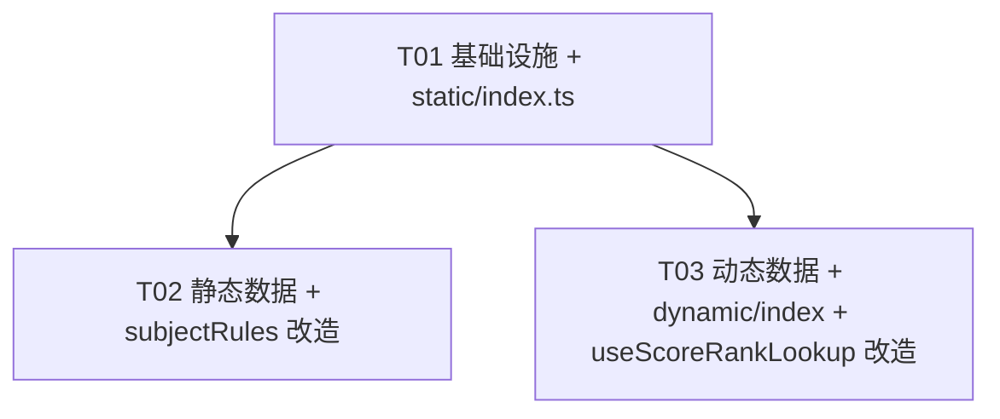

# 高考志愿填报 APP · 数据解耦架构设计（JSON 分离）

> 架构师：高见远（software-architect）
> 目标：将写死在 TS/TSX 中的业务数据解耦到独立 JSON 文件，区分「静态配置（static）」与「动态 Mock 数据（dynamic）」，为将来接入真实后端 API 预留契约。

---

## 0. 代码校验结论（基于真实代码探查，修正 team-lead 预判）

| 校验项 | team-lead 预判 | 实际探查结果 | 处置 |
|--------|----------------|--------------|------|
| `tsconfig.json` 是否缺 `resolveJsonModule` | 缺 | **确认缺**（仅 `moduleResolution: bundler` 等，无 JSON 支持） | 必须新增，否则 `tsc -b` build 失败 |
| `constants.ts` 内容 | 全静态字面量 | 确认 **17 个**导出，零逻辑 | 整体迁到 `static/*` |
| `subjectRules.ts` 覆盖率参考表 | `coverageMap` + 首选系数写死 | 确认写在 `calculateCoverage3_3` / `calculateCoverage3_1_2` 内 | 抽为 `static/subjectCoverage.json`，算法留代码 |
| `useScoreRankLookup.ts` 内联 Mock | `provinceFactor`/`mockSchools`/`mockMajors`/`tierHitRates`/risk/AI 文案 | 全部确认内联 | 抽为 `dynamic/*` |
| `recommendationStore.ts` 调用 | 调用 `generateMockRecommendations` | 签名 `(provinceCode, userRank)=>TierRecommendations` | 改造后**保持同名同签名**，store 零改动 |
| `import '@/config/constants'` 的文件数 | **11 个** | **实测 12 个**（见下表） | 薄桶方案兼容全部，12 个消费文件**零改动** |

**实测 12 个消费 `constants.ts` 的文件（薄桶 `export *` 全部兼容，无需改 import）**：

```
src/utils/validation.ts          → MAX_SCORE, RANK_DEVIATION_THRESHOLD
src/utils/provinceConfig.ts      → PROVINCES
src/components/common/LoadingOverlay.tsx   → LOADING_MESSAGES
src/pages/ResultsPage.tsx         → TIER_CONFIGS
src/pages/Step4Confirm.tsx        → WEIGHT_TEMPLATES
src/components/wizard/ScoreInput.tsx      → MAX_SCORE
src/pages/Step3Preferences.tsx    → SCHOOL_LEVELS / SCHOOL_NATURES / ECONOMIC_ZONES / SPECIAL_IDENTITIES
src/components/recommendation/WeightSummaryBar.tsx → WEIGHT_TEMPLATES
src/components/wizard/ProvincePicker.tsx  → PROVINCES
src/components/wizard/SubjectSelector.tsx → SUBJECTS_3_3, SUBJECTS_3_1_2
src/components/wizard/WeightSelector.tsx  → WEIGHT_TEMPLATES
src/components/wizard/RankDisplay.tsx     → RANK_DEVIATION_THRESHOLD
```

---

## 1. 数据分类总表

| # | 现有写死数据（来源） | 归类 | 目标 JSON 文件 | 原导出名（保留） |
|---|----------------------|------|----------------|------------------|
| 1 | `PROVINCES` (constants) | static | `static/provinces.json` | `PROVINCES` |
| 2 | `SUBJECTS_3_1_2` (constants) | static | `static/subjects.json` | `SUBJECTS_3_1_2` |
| 3 | `SUBJECTS_3_3` (constants) | static | `static/subjects.json` | `SUBJECTS_3_3` |
| 4 | `SUBJECT_LABELS` (constants) | static | `static/subjects.json` | `SUBJECT_LABELS` |
| 5 | `WEIGHT_TEMPLATES` (constants) | static | `static/weightTemplates.json` | `WEIGHT_TEMPLATES` |
| 6 | `TIER_CONFIGS` (constants) | static | `static/tierConfigs.json` | `TIER_CONFIGS` |
| 7 | `SCHOOL_LEVELS` (constants) | static | `static/options.json` | `SCHOOL_LEVELS` |
| 8 | `SCHOOL_NATURES` (constants) | static | `static/options.json` | `SCHOOL_NATURES` |
| 9 | `ECONOMIC_ZONES` (constants) | static | `static/options.json` | `ECONOMIC_ZONES` |
| 10 | `SPECIAL_IDENTITIES` (constants) | static | `static/options.json` | `SPECIAL_IDENTITIES` |
| 11 | `COMMON_MAJORS` (constants) | static | `static/searchSuggestions.json` | `COMMON_MAJORS` |
| 12 | `COMMON_CITIES` (constants) | static | `static/searchSuggestions.json` | `COMMON_CITIES` |
| 13 | `LOADING_MESSAGES` (constants) | static | `static/appConfig.json` | `LOADING_MESSAGES` |
| 14 | `STEP_NAMES` (constants) | static | `static/appConfig.json` | `STEP_NAMES` |
| 15 | `MAX_SCORE` (constants) | static | `static/appConfig.json` | `MAX_SCORE` |
| 16 | `RANK_DEVIATION_THRESHOLD` (constants) | static | `static/appConfig.json` | `RANK_DEVIATION_THRESHOLD` |
| 17 | `TOTAL_STEPS` (constants) | static | `static/appConfig.json` | `TOTAL_STEPS` |
| 18 | `coverageMap` + 首选系数 (subjectRules) | static | `static/subjectCoverage.json` | （内部读取，不对外导出） |
| 19 | `provinceFactor` / `categoryFactor` / 公式参数 (useScoreRankLookup) | dynamic | `dynamic/scoreRank.json` | （经 `getScoreRank` 契约函数） |
| 20 | `mockSchools`/`mockMajors`/`tierHitRates`/risk 模板/AI 文案 (useScoreRankLookup) | dynamic | `dynamic/recommendations.json` | （经 `getRecommendations` 契约函数） |

**静态 JSON 共 8 个**（provinces / subjects / weightTemplates / tierConfigs / options / searchSuggestions / appConfig / subjectCoverage）。
**动态 JSON 共 2 个**（scoreRank / recommendations）。

---

## 2. JSON 文件树

```
src/data/
├── static/
│   ├── index.ts                    # 加载层：import 8 个 json + as 断言 + 命名 re-export
│   ├── provinces.json              # PROVINCES
│   ├── subjects.json               # SUBJECTS_3_1_2 / SUBJECTS_3_3 / SUBJECT_LABELS
│   ├── weightTemplates.json        # WEIGHT_TEMPLATES
│   ├── tierConfigs.json           # TIER_CONFIGS
│   ├── options.json                # SCHOOL_LEVELS / SCHOOL_NATURES / ECONOMIC_ZONES / SPECIAL_IDENTITIES
│   ├── searchSuggestions.json      # COMMON_MAJORS / COMMON_CITIES
│   ├── appConfig.json              # MAX_SCORE / RANK_DEVIATION_THRESHOLD / TOTAL_STEPS / LOADING_MESSAGES / STEP_NAMES
│   └── subjectCoverage.json        # 覆盖率参考表（供 subjectRules 读取）
└── dynamic/
    ├── index.ts                    # 契约层：getScoreRank / getRecommendations（内部读 json mock）
    ├── scoreRank.json              # 省份/科类系数 + 位次计算参数（模拟一分一段表后端）
    └── recommendations.json        # 院校/专业素材 + 命中率区间 + 风险/AI 文案模板（模拟推荐后端）
```

### 各文件内容结构与示例

**`static/provinces.json`** — `ProvinceConfig[]`
```json
[
  { "code": "37", "name": "山东", "mode": "3+3", "maxVolunteers": 96,
    "volunteerUnit": "major+school", "hasAdjustment": false,
    "checkLevel": "major", "tip": "山东采用「专业+院校」志愿模式，无需服从专业调剂" },
  { "code": "13", "name": "河北", "mode": "3+1+2", "maxVolunteers": 96,
    "volunteerUnit": "major+school", "hasAdjustment": false,
    "checkLevel": "major", "tip": "河北采用「专业+院校」志愿模式" },
  { "code": "43", "name": "湖南", "mode": "3+1+2", "maxVolunteers": 45,
    "volunteerUnit": "major_group", "hasAdjustment": true,
    "checkLevel": "group", "tip": "湖南采用「院校专业组」志愿模式，需服从专业调剂" }
]
```

**`static/subjects.json`**
```json
{
  "subjects312": [
    { "value": "physics", "label": "物理", "icon": "⚡", "type": "first" },
    { "value": "history", "label": "历史", "icon": "📖", "type": "first" },
    { "value": "chemistry", "label": "化学", "icon": "🧪", "type": "second" },
    { "value": "biology", "label": "生物", "icon": "🧬", "type": "second" },
    { "value": "geography", "label": "地理", "icon": "🌍", "type": "second" },
    { "value": "politics", "label": "政治", "icon": "⚖️", "type": "second" }
  ],
  "subjects33": [
    { "value": "physics", "label": "物理", "icon": "⚡", "type": "second" },
    { "value": "history", "label": "历史", "icon": "📖", "type": "second" },
    { "value": "chemistry", "label": "化学", "icon": "🧪", "type": "second" },
    { "value": "biology", "label": "生物", "icon": "🧬", "type": "second" },
    { "value": "geography", "label": "地理", "icon": "🌍", "type": "second" },
    { "value": "politics", "label": "政治", "icon": "⚖️", "type": "second" }
  ],
  "labels": {
    "physics": "物理", "history": "历史", "chemistry": "化学",
    "biology": "生物", "geography": "地理", "politics": "政治"
  }
}
```
导出映射：`SUBJECTS_3_1_2 = data.subjects312`、`SUBJECTS_3_3 = data.subjects33`、`SUBJECT_LABELS = data.labels`，类型 `SubjectOption[]` / `Record<string,string>`。

**`static/weightTemplates.json`** — `WeightTemplate[]`
```json
[
  { "mode": "school_first", "name": "院校优先", "weights": { "school": 60, "major": 20, "city": 20 }, "desc": "优先更高层次学校" },
  { "mode": "major_first",  "name": "专业优先", "weights": { "school": 20, "major": 60, "city": 20 }, "desc": "优先目标专业" },
  { "mode": "balanced",     "name": "均衡考虑", "weights": { "school": 33, "major": 34, "city": 33 }, "desc": "三者兼顾" }
]
```

**`static/tierConfigs.json`** — `TierConfig[]`
```json
[
  { "key": "rush",     "name": "冲", "hitRateRange": "10-40%", "color": "var(--color-rush)",     "bgColor": "var(--color-rush-bg)" },
  { "key": "stable",   "name": "稳", "hitRateRange": "40-75%", "color": "var(--color-stable)",   "bgColor": "var(--color-stable-bg)" },
  { "key": "preserve", "name": "保", "hitRateRange": "75-90%", "color": "var(--color-preserve)", "bgColor": "var(--color-preserve-bg)" },
  { "key": "cushion",  "name": "垫", "hitRateRange": "90%+",   "color": "var(--color-cushion)",  "bgColor": "var(--color-cushion-bg)" }
]
```

**`static/options.json`**
```json
{
  "schoolLevels": ["985", "211", "双一流", "普通本科", "民办本科", "独立学院"],
  "schoolNatures": ["公办", "民办", "中外合作"],
  "economicZones": ["京津冀", "江浙沪", "大湾区", "成渝", "长江中游"],
  "specialIdentities": [
    { "value": "minority", "label": "少数民族", "icon": "🌍" },
    { "value": "rural", "label": "农村专项", "icon": "🌾" },
    { "value": "art_sport", "label": "艺术体育", "icon": "🎨" },
    { "value": "martyr", "label": "烈士子女", "icon": "🎖️" }
  ]
}
```
导出映射：`SCHOOL_LEVELS = data.schoolLevels`、`SCHOOL_NATURES = data.schoolNatures`、`ECONOMIC_ZONES = data.economicZones`、`SPECIAL_IDENTITIES = data.specialIdentities`。

**`static/searchSuggestions.json`**
```json
{
  "commonMajors": ["计算机科学与技术", "人工智能", "数据科学与大数据技术", "软件工程", "电子信息工程", "通信工程", "自动化", "机械工程", "土木工程", "建筑学", "临床医学", "口腔医学", "护理学", "药学", "中医学", "金融学", "会计学", "经济学", "工商管理", "市场营销", "法学", "汉语言文学", "英语", "新闻学", "广告学", "数学与应用数学", "物理学", "化学", "生物科学", "统计学", "教育学", "心理学", "社会工作", "哲学", "历史学", "考古学", "美术学", "音乐学", "体育教育"],
  "commonCities": ["北京", "上海", "广州", "深圳", "杭州", "南京", "武汉", "成都", "重庆", "西安", "天津", "苏州", "长沙", "青岛", "济南", "郑州", "合肥", "福州", "厦门", "昆明", "哈尔滨", "沈阳", "大连", "长春", "石家庄", "太原", "兰州", "南昌", "贵阳", "南宁"]
}
```

**`static/appConfig.json`**
```json
{
  "maxScore": 750,
  "rankDeviationThreshold": 0.15,
  "totalSteps": 4,
  "loadingMessages": [
    "正在分析你的分数和位次...", "匹配近3年录取数据...", "计算冲稳保垫四档方案...",
    "检测风险信号...", "生成AI填报建议...", "即将完成，请稍候..."
  ],
  "stepNames": ["基础信息", "选科组合", "意向偏好", "确认生成"]
}
```
导出映射：`MAX_SCORE`、`RANK_DEVIATION_THRESHOLD`、`TOTAL_STEPS`、`LOADING_MESSAGES`、`STEP_NAMES`。

**`static/subjectCoverage.json`** — 供 `subjectRules.ts` 读取（非对外导出常量）
```json
{
  "coverage312": {
    "physics": 90.5, "chemistry": 85.3, "biology": 65.2,
    "history": 50.1, "geography": 58.7, "politics": 45.3
  },
  "firstSubjectFactor": { "physics": 96.0, "history": 52.0 },
  "secondSubjectBonus": {
    "chemistry":       { "physics": 97.5, "history": 58.3 },
    "chemistryBiology":{ "physics": 98.2, "history": 60.1 }
  },
  "physicsChemistryBoost": 95.2
}
```
> `subjectRules.ts` 改造后：`calculateCoverage3_3` 读 `coverage312` + `physicsChemistryBoost`；`calculateCoverage3_1_2` 读 `firstSubjectFactor` + `secondSubjectBonus`。计算/取整逻辑保留在代码。

**`dynamic/scoreRank.json`** — 模拟「一分一段表」后端（省份/科类系数 + 位次公式参数）
```json
{
  "provinceFactor": { "37": 1.2, "13": 1.0, "43": 0.9 },
  "categoryFactor": { "history": 0.4, "physics": 1.0 },
  "rankFormula": {
    "scoreBase": 750,
    "baseRankSlope": 80,
    "scoreSlope": 0.08,
    "sameScoreMax": 50,
    "sameScoreMin": 5,
    "sameScoreBase": 50,
    "sameScoreDecay": 0.06
  }
}
```
> `getScoreRank(p, cat, score)` 内部实现原 `mockScoreRankLookup` 算法，参数全部从上述 json 读取。

**`dynamic/recommendations.json`** — 模拟「推荐结果」后端（素材 + 模板）
```json
{
  "schools": [
    { "name": "山东大学", "city": "济南", "level": "985", "nature": "公办" },
    { "name": "中国海洋大学", "city": "青岛", "level": "985", "nature": "公办" },
    { "name": "山东师范大学", "city": "济南", "level": "省重点", "nature": "公办" },
    { "name": "青岛大学", "city": "青岛", "level": "省重点", "nature": "公办" },
    { "name": "济南大学", "city": "济南", "level": "普通本科", "nature": "公办" },
    { "name": "山东科技大学", "city": "青岛", "level": "普通本科", "nature": "公办" },
    { "name": "山东理工大学", "city": "淄博", "level": "普通本科", "nature": "公办" },
    { "name": "烟台大学", "city": "烟台", "level": "普通本科", "nature": "公办" }
  ],
  "majors": ["计算机科学与技术","人工智能","数据科学与大数据技术","软件工程","电子信息工程","自动化","机械工程","金融学","会计学","法学"],
  "tierHitRates": { "rush": [10,40], "stable": [40,75], "preserve": [75,90], "cushion": [90,99] },
  "riskTemplates": {
    "rank_rising":  { "type": "rank_rising",  "level": "medium", "message": "近2年位次上升8%", "suggestion": "冲刺档可适当靠前填报" },
    "plan_reduced": { "type": "plan_reduced", "level": "low",    "message": "今年招生计划减少15%", "suggestion": "竞争增加但位次仍有优势" }
  },
  "aiAdviceTemplates": {
    "rush":     "${schoolName}${major}专业实力强劲，你的位次处于录取区间下沿，建议作为冲刺档填报。",
    "stable":   "${schoolName}${major}专业与你的选科高度匹配，建议放在稳档前1/3位置。",
    "preserve": "${schoolName}${major}录取把握较大，建议作为保底档的核心选择。",
    "cushion":  "${schoolName}${major}录取几乎确定，作为垫底保障确保不滑档。"
  },
  "aiAdvantageTemplate": "${schoolName}${major}专业与你的选科高度匹配，学科评估优秀。",
  "aiSuggestionStable": "建议放在稳档前1/3位置（约第8-12个志愿）",
  "aiSuggestionGeneric": "建议放在${tierName}合适位置",
  "defaultDataSource": "${provinceName}省教育招生考试院",
  "dataYear": "2022-2024年",
  "newMajorList": ["人工智能", "数据科学与大数据技术"],
  "tuitionRule": { "base": 5000, "step": 1000 },
  "duration": "四年",
  "degreeRule": { "engineeringKeywords": ["工程","计算机"], "engineeringDegree": "工学学士", "defaultDegree": "理学学士" },
  "conversionMethod": "等比例缩放法 + 线性插值法"
}
```
> `getRecommendations(p, rank)` 保留原 `makeRec` 拼装逻辑，所有素材/模板从上述 json 读取。

---

## 3. 加载层设计

### 3.1 `src/data/static/index.ts`（数据入口，统一 as 断言 + 命名导出）
```ts
import type { ProvinceConfig, SubjectOption, WeightTemplate, TierConfig } from '@/types/common';

import provincesData from '@/data/static/provinces.json';
import subjectsData from '@/data/static/subjects.json';
import weightTemplatesData from '@/data/static/weightTemplates.json';
import tierConfigsData from '@/data/static/tierConfigs.json';
import optionsData from '@/data/static/options.json';
import searchSuggestionsData from '@/data/static/searchSuggestions.json';
import appConfigData from '@/data/static/appConfig.json';

export const PROVINCES = provincesData as ProvinceConfig[];
export const SUBJECTS_3_1_2 = subjectsData.subjects312 as SubjectOption[];
export const SUBJECTS_3_3 = subjectsData.subjects33 as SubjectOption[];
export const SUBJECT_LABELS = subjectsData.labels as Record<string, string>;
export const WEIGHT_TEMPLATES = weightTemplatesData as WeightTemplate[];
export const TIER_CONFIGS = tierConfigsData as TierConfig[];
export const SCHOOL_LEVELS = optionsData.schoolLevels as string[];
export const SCHOOL_NATURES = optionsData.schoolNatures as string[];
export const ECONOMIC_ZONES = optionsData.economicZones as string[];
export const SPECIAL_IDENTITIES = optionsData.specialIdentities as { value: string; label: string; icon: string }[];
export const COMMON_MAJORS = searchSuggestionsData.commonMajors as string[];
export const COMMON_CITIES = searchSuggestionsData.commonCities as string[];
export const LOADING_MESSAGES = appConfigData.loadingMessages as string[];
export const STEP_NAMES = appConfigData.stepNames as string[];
export const MAX_SCORE = appConfigData.maxScore as number;
export const RANK_DEVIATION_THRESHOLD = appConfigData.rankDeviationThreshold as number;
export const TOTAL_STEPS = appConfigData.totalSteps as number;
```

### 3.2 `src/config/constants.ts`（改造为薄 re-export 桶，零改动 12 个消费方）
```ts
/**
 * 应用常量配置（薄 re-export 桶）
 * 真实数据已解耦到 src/data/static/*.json
 * 保留此桶以兼容现有 12 处 `import ... from '@/config/constants'` 路径
 */
export * from '@/data/static';
```
> 说明：原 `import type { ... } from '@/types/common'` 不再需要（类型断言已移到 `static/index.ts`，此处删除）。`export *` 自动暴露全部命名常量，命名与旧版完全一致。

### 3.3 `src/data/dynamic/index.ts`（契约层：返回 JSON mock，标注未来替换为真实 fetch）
```ts
import scoreRankData from '@/data/dynamic/scoreRank.json';
import recommendationsData from '@/data/dynamic/recommendations.json';
import type { RankLookupResult } from '@/types/form';
import type { TierRecommendations, Recommendation } from '@/types/recommendation';

/** 动态数据（mock 样例，代表后端契约形状） */
export const scoreRankMock = scoreRankData;
export const recommendationsMock = recommendationsData;

/**
 * 分数→位次反查（契约函数）
 * 当前：内部读 scoreRank.json 做 mock 计算
 * TODO: 将来替换为真实后端 fetch(`/api/score-rank?province=...&category=...&score=...`)
 */
export function getScoreRank(
  provinceCode: string, subjectCategory: string, score: number,
): RankLookupResult {
  // ...从 scoreRankMock 读取 provinceFactor / categoryFactor / rankFormula 实现原算法
}

/**
 * 推荐结果生成（契约函数）
 * 当前：内部读 recommendations.json 做 mock 拼装
 * TODO: 将来替换为真实后端 fetch(`/api/recommendations?province=...&rank=...`)
 */
export function getRecommendations(
  provinceCode: string, userRank: number,
): TierRecommendations {
  // ...从 recommendationsMock 读取 schools / majors / templates 实现原 makeRec 拼装逻辑
}
```

### 3.4 消费方改造要点（仅 2 个文件，均在任务内）
- **`src/utils/subjectRules.ts`**：删除 `calculateCoverage3_3/3_1_2` 内联字面量表，改为 `import { subjectCoverage } from '@/data/static'`（需在 `static/index.ts` 额外 `export const SUBJECT_COVERAGE = subjectCoverageData`），保留取整/加成计算逻辑。
- **`src/hooks/useScoreRankLookup.ts`**：删除 `provinceFactor`/`mockSchools`/`mockMajors` 等内联数据；`mockScoreRankLookup` 改为调用 `getScoreRank`，`generateMockRecommendations` 改为调用 `getRecommendations`（**保持函数名与签名不变**，store 零改动）；Hook 的 `useCallback/setTimeout/store` 更新逻辑原样保留。

> 注：`static/index.ts` 需额外导出 `SUBJECT_COVERAGE`（供 subjectRules 用，非原 constants 公开常量，但属于合理内部导出）。

---

## 4. 有序任务列表（依赖 / 实现顺序）

> 满足约束：≤5 任务、每任务 ≥3 文件、T01 为基础设施、依赖链短（仅 T01→T02/T03）。

### T01 — 项目基础设施与静态加载层入口
- **依赖**：无
- **优先级**：P0
- **源文件（3）**：
  1. `tsconfig.json`（新增 `"resolveJsonModule": true`）
  2. `src/config/constants.ts`（改造为薄桶 `export * from '@/data/static'`）
  3. `src/data/static/index.ts`（创建，import 8 个 static json 并 `as` 断言 re-export 全部命名常量 + `SUBJECT_COVERAGE`）

### T02 — 静态配置数据解耦与静态消费适配
- **依赖**：T01（`static/index.ts` 需 import 到这些 json）
- **优先级**：P0
- **源文件（9）**：
  1. `src/data/static/provinces.json`
  2. `src/data/static/subjects.json`
  3. `src/data/static/weightTemplates.json`
  4. `src/data/static/tierConfigs.json`
  5. `src/data/static/options.json`
  6. `src/data/static/searchSuggestions.json`
  7. `src/data/static/appConfig.json`
  8. `src/data/static/subjectCoverage.json`
  9. `src/utils/subjectRules.ts`（改造：读 `SUBJECT_COVERAGE` 替换内联覆盖率表）

### T03 — 动态 Mock 数据解耦与动态消费适配
- **依赖**：T01（`dynamic/index.ts` 与 `useScoreRankLookup.ts` 改造需静态加载层就绪）
- **优先级**：P0
- **源文件（4）**：
  1. `src/data/dynamic/scoreRank.json`
  2. `src/data/dynamic/recommendations.json`
  3. `src/data/dynamic/index.ts`（创建：import 2 个 json，实现 `getScoreRank` / `getRecommendations` 契约函数，标注 TODO fetch）
  4. `src/hooks/useScoreRankLookup.ts`（改造：调用 dynamic 契约函数，删内联 mock 数据，保留 Hook 逻辑与 `generateMockRecommendations` 同名签名）

### 任务依赖图


---

## 5. 共享约定

1. **JSON 类型断言方式**：
   - 统一用 `import data from '@/data/static/xxx.json'`（默认导入，Vite + `resolveJsonModule` 支持）。
   - 业务类型化用 `export const X = data as SomeType`；若 JSON 推断结构与业务类型存在字面量/字段差异，降级用 `as unknown as SomeType`。
   - 不删除 `src/types/*` 任何类型定义，断言一律引用现有类型。
2. **import 路径规范**：
   - JSON 一律用别名带后缀：`@/data/static/xxx.json`、`@/data/dynamic/xxx.json`。
   - TS 模块统一 `@/data/static`、`@/data/dynamic` 加载层，**业务代码不要直接 import json**，统一经 `static/index.ts` 或 `dynamic/index.ts`。
3. **命名规范**：
   - JSON 文件名：`kebab-case`（如 `subjectCoverage.json`）。
   - 静态导出常量名：与原 `constants.ts` **完全一致**（`PROVINCES` 等），保证薄桶 re-export 与 12 个消费方零改动。
   - 动态契约函数：`getXxx(...)` 形式（`getScoreRank` / `getRecommendations`），参数为 `(provinceCode, ...)`。
   - 动态模板占位符：统一 `${schoolName}` `${major}` `${provinceName}` `${tierName}` 形式，拼装逻辑在代码。
4. **数据与逻辑边界**：
   - static = 运行时不变的配置/参考值；dynamic = 本应由后端返回、当前用 JSON mock 的数据。
   - 算法/拼装逻辑（覆盖率计算、位次公式、推荐 makeRec）**留在代码**，JSON 只存素材与参数。
5. **契约演进**：`dynamic/index.ts` 每个契约函数上方注释 `TODO: 将来替换为真实后端 fetch(...)`，函数签名即为未来 API 契约。

---

## 6. 待明确事项

1. **消费文件数差异**：team-lead 记录 11 个，实测 12 个（多 `RankDisplay.tsx`）。薄桶方案对两者均兼容，**不影响实现**，仅记录修正。
2. **`COMMON_MAJORS` 与 `recommendations.json.majors` 内容重叠**：前者是「搜索联想静态配置」，后者是「动态 mock 院校专业素材」，语义不同故分置。若未来希望共用单一数据源需再议。
3. **`subjectCoverage` 归类**：当前为 2024 教育部统计固定参考值，归 **static**（配置/规则参数）而非 dynamic（mock 后端），符合「非实时后端数据」语义。如认为应随年份更新而动态下发，可调为 dynamic——请确认。
4. **`scoreRank.json` 是否携带位次公式参数**：本设计把 `rankFormula` 参数一并放入（贴近「前端只发请求、算法在后端」的契约）。若希望公式参数仍留代码、json 只放 `provinceFactor`/`categoryFactor`，请确认。
5. **推荐数量（rush19/stable12/preserve14/cushion5）**：本设计保留在 `dynamic/index.ts` 的生成逻辑常量中（未放入 json）。如希望数量也作为动态可配（不同省份/年份不同），可加 `recommendations.json.counts` 字段——请确认是否必要。
6. **`getScoreRank` / `getRecommendations` 是否需异步化**：当前为同步返回（模拟），与现有 `useScoreRankLookup` 内 `setTimeout` 异步包裹一致。若想让契约函数本身返回 `Promise`（更贴近真实 fetch），需同步调整 hook，请确认期望形态。
